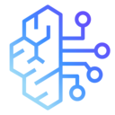

# Best AI Inference Providers Curated by GitHub Users

Open Source and Always a Work in Progress (WIP)

## Abstract

<!-- annotation: Simply the facts. -->

This technical assessment provides an evidence-based analysis of AI inference / LLM providers. In contrast to commercial review sites, this framework prioritizes empirical analysis via independent security audits, public source code availability, and operational transparency focused on privacy.

## Methodology

### Evaluation Criteria

Our evaluation considers:

1. **Code Transparency**: Public availability of source code and model weights
2. **Independent Verification**: Third party review and documentation
3. **Architectural Verifiability**: Fact or trust
4. **Organizational Transparency**: Public disclosure of ownership and policies
5. **Privacy Architecture**: Technical implementation and training defaults

<!-- callout: Ignore the marketing. Read the facts. -->

## AI Service Comparison

| Rank | Service | Source Available | Proof | Anonymous Use | Self-Hostable | No Training on Data | No Correlation |
|------|---------|------------------|-------|---------------|---------------|---------------------|----------------|
| 1 |  Self-Hosted Open-Weights | ✓ Yes | ✓ Yes (you control) | ✓ Yes | ✓ Yes | ✓ Yes | ✓ Yes |
| 2 |  [Lumo (Proton)](https://lumo.proton.me/) | [~ Mixed](https://github.com/ProtonLumo) (clients open; backend/models not fully public) | [✓ Yes](https://proton.me/blog/soc-2) | ✗ No (Proton account required) | ✗ No | ✓ Yes | ? |
| 3 |  [Venice AI](https://venice.ai/) | Mixed (open models; platform proprietary) | [✓ Yes](https://venice.ai/privacy) | ✓ Yes (no-login free tier) | ✗ No | ✓ Yes | ? |
| 4 |  [Hugging Face Endpoints](https://huggingface.co/inference-endpoints) | [✓ Yes](https://github.com/huggingface) | [✓ Yes](https://huggingface.co/security) | ✗ No | ✓ Yes | ✓ Yes | ? |
| 5 |  [AWS Bedrock](https://aws.amazon.com/bedrock/) | ✓ Yes (mixed) | [✓ Yes](https://aws.amazon.com/compliance/) | ✗ No | ✗ No | ✓ Yes | ? |
| 6 |  [Google Vertex AI](https://cloud.google.com/vertex-ai) | ✗ No | [✓ Yes](https://cloud.google.com/security/compliance) | ✗ No | ✗ No | ✓ Yes (restricted) | ? |
| 7 |  [Azure OpenAI](https://azure.microsoft.com/en-us/solutions/ai/) | ✗ No | [✓ Yes](https://learn.microsoft.com/en-us/azure/compliance/) | ✗ No | ✗ No | ✓ Yes | ? |
| 8 |  [Meta Llama API](https://llama.com) | [✓ Yes](https://github.com/meta-llama) (open weights) | [✓ Yes](https://www.llama.com/security/) | ✗ No | ✓ Yes | ✓ Yes | ? |
| 9 |  [Together AI](https://www.together.ai/) | ✓ Yes (mostly open) | [✓ Yes](https://www.togetherplatform.com/security-compliance) | ✗ No | ✓ Yes | ✓ Yes (configurable) | ? |
| 10 |  [OpenAI API/Team/Enterprise](https://openai.com/enterprise) | ✗ No | [✓ Yes](https://openai.com/security-and-privacy/) | ✗ No | ✗ No (limited) | ✓ Yes (Enterprise/API) | ? |
| 11 |  [Mistral](https://mistral.ai/) | ✓ Yes (mixed) | [✓ Yes](https://help.mistral.ai/en/articles/323762-how-do-you-ensure-the-security-of-your-users-data) | ✗ No | ✓ Yes | ✓ Yes (Enterprise) | ? |
| 12 |  [Cohere](https://cohere.com/) | ✗ No | [✓ Yes](https://cohere.com/security) | ✗ No | ✗ No | ✗ No (opt-out required) | ? |
| 13 |  [Claude (Anthropic)](https://claude.ai/) | ✗ No | [✓ Yes](https://docs.anthropic.com/en/docs/claude-code/security) | ✗ No | ✗ No | ✗ No (Consumer) / ✓ Yes (Enterprise) | ? |

## Critical Understanding: Architectural vs Policy Based Privacy

### Class 1: Architectural Privacy (Self-Hosted)

The following approach represents complete control over AI inference. **External providers cannot train on your data by design**.

- **Self-Hosted Open-Weights Models**: Complete control over inference; no third-party logs, retention, or training; architecturally private. Models include Llama 3, Mistral, Qwen, Phi, Gemma, Mixtral. Frameworks include Ollama, vLLM, LM Studio, Text Generation WebUI, TGI/HuggingFace, local CUDA/MPS/Metal inference.

### Class 2: Privacy-Oriented Hosted Providers

These providers attempt to architect systems to minimize data exposure (but still require trust):

- **Lumo (Proton)**: Zero-access encryption of chat history; no logs of conversations; no training on user prompts; open-source codebase claimed publicly; production pipeline not attested, trust required.
- **Venice AI**: Local-only history; no server-side logging; decentralized GPU compute; no training on user prompts; encryption via local browser + proxy; no third-party audits, trust required. Exposes decrypted prompts to decentralized GPU operators during inference.

### Class 3: Contractually Private Enterprise/API

These providers **do not train on enterprise/API data by policy**, verified through documentation and compliance frameworks. Note: These are managed cloud services and cannot be self-hosted.

- **Hugging Face Endpoints**: No training on user data; SOC 2 compliance; models can be self-hosted separately
- **AWS Bedrock**: No training on user data; extensive compliance certifications; managed service only
- **Google Vertex AI**: No training on user data (restricted); compliance certified; managed service only
- **Azure OpenAI**: No training on user data; compliance certified; managed service only
- **Meta Llama API**: No training on user data; Llama models can be self-hosted separately
- **Together AI**: Configurable retention; can disable training; uses open models that can be self-hosted separately
- **OpenAI (Enterprise/API)**: No training on user data for paid enterprise/API tiers; proprietary models
- **Mistral (Enterprise)**: No training on user data for enterprise tier; open models can be self-hosted separately

All rely on trust in infrastructure, operations teams, provider honesty, provider logs, and subpoena/LEA exposure.

### Class 4: Policy-Based Privacy (Opt-Out Required)

Providers that train on user data by default; privacy requires configuration:

- **Mistral (Consumer)**: Trains on user data by default
- **Cohere**: Requires explicit opt-out
- **Claude (Consumer)**: Uses chats and coding sessions for training by default unless you opt out; Anthropic currently keeps this data for up to ~5 years

## Detailed Service Analysis

### 1. Self-Hosted Open-Weights Models

* **Code transparency:** Fully available (Llama, Mistral, Qwen, Phi, Gemma, Mixtral, etc.)
* **Verification:** You control all aspects
* **Org transparency:** N/A (you are the operator)
* **Privacy architecture:** Complete isolation; no third-party access; no external logging or training
* **Signup & payment:** N/A
* **What's logged (by policy):** Nothing (you control all logs)
* **Demonstrated correlation capability:** None (you control infrastructure)
* **Operational history:** Varies by model (1-3+ years)

---

### 2. Lumo (Proton)

* **Code transparency:** Proton markets Lumo as open source and publishes client apps and some controls on GitHub, but the full backend stack and model weights are not yet fully public.
* **Verification:** [Proton security documentation](https://proton.me/blog/soc-2)
* **Org transparency:** [Fully disclosed](https://proton.me/about)
* **Privacy architecture:** Zero-access encryption for stored chat history; Proton states it does not log or use conversations to train models; production pipeline still requires trust.
* **Signup & payment:** Proton account required (email or alias); no fully anonymous use
* **What's logged (by policy):** Account metadata only
* **Demonstrated correlation capability:** Unknown
* **Operational history:** ~1 year (launched 2024)

---

### 3. Venice AI

* **Code transparency:** Uses open models; platform proprietary
* **Verification:** [Privacy architecture documentation](https://venice.ai/privacy)
* **Org transparency:** [Disclosed](https://venice.ai/about)
* **Privacy architecture:** Local-only history; no server-side logging; decentralized GPU compute; browser-based encryption
* **Signup & payment:** No account needed for basic free tier; email required for higher limits/Pro
* **What's logged (by policy):** No prompts or model responses server-side; limited metadata and event logs retained
* **Demonstrated correlation capability:** Prompts exposed to decentralized GPU operators during inference
* **Operational history:** ~1 year (launched 2024)

---

### 4. Hugging Face Endpoints

* **Code transparency:** [Fully published](https://github.com/huggingface)
* **Verification:** [SOC 2 Type 2 certified](https://huggingface.co/security)
* **Org transparency:** [Fully disclosed](https://huggingface.co/huggingface)
* **Privacy architecture:** Isolated inference; no training on user data; dedicated endpoints available
* **Signup & payment:** Email required; accepts card
* **What's logged (by policy):** Access logs (configurable retention)
* **Demonstrated correlation capability:** None disclosed
* **Operational history:** ~8 years

---

### 5. AWS Bedrock

* **Code transparency:** Mixed (some models open, infrastructure proprietary)
* **Verification:** [Extensive compliance certifications](https://aws.amazon.com/compliance/)
* **Org transparency:** [Fully disclosed](https://aws.amazon.com/about-aws/)
* **Privacy architecture:** Customer data isolation; no training on customer data
* **Signup & payment:** Email required; accepts card
* **What's logged (by policy):** CloudTrail logs (customer controlled)
* **Demonstrated correlation capability:** None disclosed
* **Operational history:** ~18 years (AWS), ~2 years (Bedrock)

---

### 6. Google Vertex AI

* **Code transparency:** Proprietary
* **Verification:** [Compliance certifications](https://cloud.google.com/security/compliance)
* **Org transparency:** [Fully disclosed](https://about.google/)
* **Privacy architecture:** Customer data isolation; restricted training policies
* **Signup & payment:** Email required; accepts card
* **What's logged (by policy):** Cloud Logging (customer controlled)
* **Demonstrated correlation capability:** None disclosed
* **Operational history:** ~17 years (Google Cloud), ~3 years (Vertex AI)

---

### 7. Azure OpenAI

* **Code transparency:** Proprietary
* **Verification:** [Compliance certifications](https://learn.microsoft.com/en-us/azure/compliance/)
* **Org transparency:** [Fully disclosed](https://www.microsoft.com/en-us/about)
* **Privacy architecture:** Customer data isolation; no training on customer data
* **Signup & payment:** Email required; accepts card
* **What's logged (by policy):** Azure Monitor logs (customer controlled)
* **Demonstrated correlation capability:** None disclosed
* **Operational history:** ~15 years (Azure), ~2 years (Azure OpenAI)

---

### 8. Meta Llama API

* **Code transparency:** [Open weights published](https://github.com/meta-llama)
* **Verification:** [Security documentation](https://www.llama.com/security/)
* **Org transparency:** [Fully disclosed](https://about.meta.com/)
* **Privacy architecture:** No training on API user data; standard cloud logging
* **Signup & payment:** Email required; accepts card
* **What's logged (by policy):** Standard access logs
* **Demonstrated correlation capability:** None disclosed
* **Operational history:** ~2 years (API), ~20 years (Meta)

---

### 9. Together AI

* **Code transparency:** Mostly open models
* **Verification:** [Security and compliance documentation](https://docs.together.ai/docs/deployment-options)
* **Org transparency:** [Disclosed](https://www.together.ai/about)
* **Privacy architecture:** Configurable data retention; can disable training
* **Signup & payment:** Email required; accepts card
* **What's logged (by policy):** Configurable
* **Demonstrated correlation capability:** None disclosed
* **Operational history:** ~3 years

---

### 10. OpenAI API/Team/Enterprise

* **Code transparency:** Proprietary
* **Verification:** [SOC 2 Type 2 certified](https://openai.com/security/)
* **Org transparency:** [Disclosed](https://en.wikipedia.org/wiki/OpenAI)
* **Privacy architecture:** No training on API/Enterprise data; standard cloud infrastructure
* **Signup & payment:** Email required; accepts card
* **What's logged (by policy):** API logs retained up to 30 days for abuse monitoring; business products (Team/Enterprise/Edu) have configurable retention; consumer/free tiers retain data longer for product improvement
* **Demonstrated correlation capability:** None disclosed
* **Operational history:** ~7 years

---

### 11. Mistral

* **Code transparency:** Mixed (open models + proprietary)
* **Verification:** [Security documentation](https://help.mistral.ai/en/articles/347640-may-i-consult-your-list-of-technical-and-organisational-security-measures)
* **Org transparency:** [Disclosed](https://mistral.ai/company/)
* **Privacy architecture:** No training on enterprise data; consumer tier trains by default
* **Signup & payment:** Email required; accepts card
* **What's logged (by policy):** Varies by tier
* **Demonstrated correlation capability:** None disclosed
* **Operational history:** ~2 years

---

### 12. Cohere

* **Code transparency:** Proprietary
* **Verification:** [SOC 2 Type 2 certified](https://cohere.com/security)
* **Org transparency:** [Disclosed](https://cohere.com/about)
* **Privacy architecture:** Training opt-out required; enterprise options available
* **Signup & payment:** Email required; accepts card
* **What's logged (by policy):** Standard access logs
* **Demonstrated correlation capability:** None disclosed
* **Operational history:** ~4 years

---

### 13. Claude (Anthropic)

* **Code transparency:** Proprietary
* **Verification:** [SOC 2 Type 2 certified](https://privacy.anthropic.com/en/articles/10015870-do-you-have-a-soc-2-or-hipaa-certifications)
* **Org transparency:** [Disclosed](https://www.anthropic.com/company)
* **Privacy architecture:** Consumer tier trains by default unless you opt out; Enterprise/API data not used for training
* **Signup & payment:** Email required; accepts card
* **What's logged (by policy):** Consumer: retention currently up to ~5 years; Enterprise/API: no training use
* **Demonstrated correlation capability:** None disclosed
* **Operational history:** ~3 years

## Conclusion

Self-hosting represents the only truly verifiable privacy option for AI inference. All hosted providers, even the most privacy-focused like Lumo and Venice, rely on trust in infrastructure, operations, and policies rather than cryptographically verifiable architecture.

The privacy hierarchy is clear: architectural privacy (self-hosting) > privacy-oriented providers (Lumo, Venice) > enterprise/API tiers with contractual no-training guarantees > consumer services with opt-out training.

For maximum privacy: run open-weights models (Llama, Mistral, Qwen) locally using Ollama, vLLM, or similar frameworks. Everything else requires trust.

<!-- navigation -->
[Abstract](#abstract) [Methodology](#methodology) [Comparison](#ai-service-comparison) [Categories](#critical-understanding-architectural-vs-policy-based-privacy) [Details](#detailed-service-analysis) [Conclusion](#conclusion)

## Footer

A public service by the users of Github.
