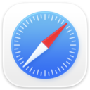

# Best Browsers Curated by Github Users

Open Source and Always a Work in Progress (WIP)

## Abstract

<!-- annotation: Privacy by architecture, not by promise. -->

This technical assessment provides an evidence-based analysis of web browsers. In contrast to commercial review sites that focus on features and speed, this framework prioritizes architectural privacy, verifiable transparency, and telemetry behavior. The analysis covers desktop, Android, and iOS separately to reflect platform-specific constraints and capabilities.

## Methodology

### Evaluation Criteria

Our evaluation considers:

1. **Code Transparency**: Public source code and reproducible builds
2. **Telemetry Behavior**: Default analytics, identifiers, and opt-out mechanisms
3. **Certificate Verification**: OCSP/CRL lookups and user control
4. **Safe Browsing Implementation**: Reputation provider selection and privacy
5. **Proxy Support**: Full SOCKS/HTTP/PAC or specialized routing
6. **Tracker Blocking**: Built-in protection and default configuration
7. **Fingerprint Resistance**: Canvas randomization and surface uniformity
8. **Organizational Transparency**: Public ownership and funding disclosure

<!-- callout: Browser privacy is determined by what the code cannot do, not what settings claim to do. -->

## Desktop Browser Comparison

| Rank | Browser | Open Source | Telemetry | OCSP Control | Safe Browsing | Proxy | Tracker Block | FP Defense |
|------|---------|-------------|-----------|--------------|---------------|-------|---------------|------------|
| 1 |  [Mullvad Browser](https://mullvad.net/en/browser) | [✓ Yes](https://gitlab.torproject.org/tpo/applications/mullvad-browser) | ✗ No | ✓ Yes | ✗ No | ✓ Yes | ✓ Yes | ✓ Yes |
| 2 |  [Brave](https://brave.com/) | [✓ Yes](https://github.com/brave/brave-browser) | [✓ Yes](https://brave.com/privacy-updates/) (opt-out) | ✓ Partial | ✓ Yes | ✓ Yes (system/flags) | ✓ Yes | ✓ Yes |
| 3 |  [Firefox](https://www.mozilla.org/firefox) | [✓ Yes](https://hg.mozilla.org/mozilla-central/) | ✓ Yes (opt-out) | ✓ Yes | ✓ Yes | ✓ Yes (full UI) | ✓ Yes | ✓ Yes |
| 4 |  [Tor Browser](https://www.torproject.org/) | [✓ Yes](https://gitlab.torproject.org/tpo/applications/tor-browser) | ✗ No | ✓ Yes | ✗ No | ✓ Yes | ✓ Yes | ✓ Yes |
| 5 |  [Waterfox](https://www.waterfox.net/) | [✓ Yes](https://github.com/WaterfoxCo/Waterfox) | ✗ No | ✓ Yes | ✓ Yes | ✓ Yes | ✓ Yes | ✓ Partial |
| 6 |  [Vivaldi](https://vivaldi.com/) | [✓ Partial](https://vivaldi.com/source/) | ✓ Yes | ✗ No | ✓ Yes | ✓ Yes (system/flags) | ✓ Yes | ✗ No |
| 7 |  [Safari](https://www.apple.com/safari/) | ✓ Partial | ✗ No | ✗ No | ✓ Yes (configurable) | ✗ No | ✓ Yes | ✓ Partial |
| 8 |  [Chromium](https://www.chromium.org/) | [✓ Yes](https://chromium.googlesource.com/chromium/src/) | ✗ No | ✓ Partial (CRLSets) | ✓ Yes | ✓ Yes (system/flags) | ✗ No | ✗ No |
| 9 |  [Edge](https://www.microsoft.com/edge) | ✗ No | ✓ Yes | ✗ No | ✓ Yes (configurable) | ✓ Yes (system/flags) | ✓ Yes (tracking prevention) | ✗ No |
| 10 |  [Chrome](https://www.google.com/chrome/) | ✗ No | ✓ Yes | ✓ Partial (CRLSets) | ✓ Yes | ✓ Yes (system/flags) | ✓ Partial | ✗ No |

## Android Browser Comparison

| Rank | Browser | Open Source | Telemetry | Safe Browsing | Proxy | Tracker Block | FP Defense |
|------|---------|-------------|-----------|---------------|-------|---------------|------------|
| 1 |  [Brave](https://brave.com/) | [✓ Yes](https://github.com/brave/brave-browser) | [✓ Yes](https://brave.com/privacy-updates/) (opt-out) | ✓ Yes | ✓ Yes | ✓ Yes | ✓ Yes |
| 2 |  [Tor Browser](https://www.torproject.org/download/) | [✓ Yes](https://gitlab.torproject.org/tpo/applications/tor-browser) | ✗ No | ✗ No | ✓ Yes | ✓ Yes | ✓ Yes |
| 3 |  [Firefox](https://www.mozilla.org/firefox/android/) | [✓ Yes](https://hg.mozilla.org/mozilla-central/) | ✓ Yes (opt-out) | ✓ Yes | ✓ Yes | ✓ Yes | ✓ Yes |
| 4 |  [DuckDuckGo](https://duckduckgo.com/app) | [✓ Yes](https://github.com/duckduckgo/Android) | ✓ Minimal (diagnostics only; no browsing history) | ✓ Yes | ✓ Yes | ✓ Yes | ✓ Partial |
| 5 |  [Vivaldi](https://vivaldi.com/) | [✓ Partial](https://vivaldi.com/source/) | ✓ Yes | ✓ Yes | ✓ Yes | ✓ Yes | ✗ No |
| 6 |  [Edge](https://www.microsoft.com/edge) | ✗ No | ✓ Yes | ✓ Yes | ✓ Yes | ✓ Partial | ✗ No |
| 7 |  [Chrome](https://www.google.com/chrome/) | ✗ No | ✓ Yes | ✓ Yes | ✓ Yes | ✗ No | ✗ No |

## iOS Browser Comparison

| Rank | Browser | Open Source | Telemetry | Tracker Block | Safe Browsing |
|------|---------|-------------|-----------|---------------|---------------|
| 1 |  [Brave](https://apps.apple.com/app/brave/id1052879175) | [✓ Yes](https://github.com/brave/brave-core) | [✓ Yes](https://brave.com/privacy-updates/) (opt-out) | ✓ Yes | ✓ Yes |
| 2 |  [DuckDuckGo](https://apps.apple.com/app/duckduckgo-privacy-browser/id663592361) | [✓ Yes](https://github.com/duckduckgo/iOS) | ✓ Minimal (diagnostics only; no browsing history) | ✓ Yes | ✓ Yes |
| 3 |  [Firefox](https://apps.apple.com/app/firefox/id989804926) | [✓ Yes](https://github.com/mozilla-mobile/firefox-ios) | ✓ Yes (opt-out) | ✓ Yes | ✓ Yes |
| 4 |  [Safari](https://www.apple.com/safari/) | ✗ No | ✗ No | ✓ Yes | ✓ Yes |
| 5 |  [Edge](https://apps.apple.com/app/microsoft-edge/id1288723196) | ✗ No | ✓ Yes | ✓ Partial | ✓ Yes |
| 6 |  [Chrome](https://apps.apple.com/app/google-chrome/id535886823) | ✗ No | ✓ Yes | ✓ Partial | ✓ Yes |

## Critical Understanding: Platform Constraints vs Browser Privacy

### Desktop & Android: True Engine Diversity

Desktop and Android platforms allow true browser engine diversity, enabling fundamental architectural privacy differences:

- **Gecko-based**: Firefox, Waterfox, Tor Browser, Mullvad Browser. Independent rendering engine with decades of development.
- **Chromium-based**: Brave, Vivaldi, Edge, Chrome. Dominant engine powering most browsers; privacy depends on distributor modifications.
- **WebKit-based**: Safari. Apple's engine, deeply integrated with macOS/iOS.

### iOS: WebKit Mandate

All browsers on iOS must use Apple's WebKit engine per App Store requirements.* This architectural constraint means:

- **Privacy differences exist only in telemetry and configuration layers**, not in fundamental network architecture
- **Extension capabilities are severely limited** compared to desktop counterparts
- **True browser engine diversity is impossible** on iOS
- **Rankings reflect configuration quality** on top of the mandatory WebKit foundation

*Since iOS 17.4 (March 2024), non-WebKit browsers are permitted in the EU via entitlements; elsewhere, WebKit remains mandatory. As of late-2025, mainstream non-WebKit iOS browsers remain scarce in the EU due to Apple's implementation hurdles.

## Detailed Browser Analysis

### 1. Mullvad Browser

* **Code transparency:** [Fully published](https://gitlab.torproject.org/tpo/applications/mullvad-browser)
* **Verification:** Joint Mullvad–Tor Project; reproducible builds
* **Org transparency:** [Fully disclosed](https://mullvad.net/en/about)
* **Telemetry:** Yes, opt-out (privacy-preserving analytics, crash logs, and usage pings; all can be disabled) (compile-time removal)
* **OCSP/Certificate checking:** Makes OCSP connections (soft-fail mode); phishing/malware protection disabled
* **Safe Browsing:** None (no external reputation services)
* **Proxy support:** Full SOCKS5/HTTP/PAC configuration
* **Tracker blocking:** Built-in blocklists identical to Tor Browser
* **Fingerprint defense:** Uniform fingerprint across all users (letterboxing, canvas protection)
* **What's logged (by design):** Nothing
* **Demonstrated correlation capability:** Architecturally prevented
* **Operational history:** Launched 2023 as Mullvad–Tor collaboration

---

### 2. Brave

* **Code transparency:** [Fully published](https://github.com/brave/brave-browser)
* **Verification:** [Regular third-party audits](https://brave.com/privacy-updates/)
* **Org transparency:** [Fully disclosed](https://brave.com/about/)
* **Telemetry:** Yes, opt-out (privacy-preserving P3A anonymized metrics)
* **OCSP/Certificate checking:** Partial user control
* **Safe Browsing:** Google Safe Browsing, using a privacy-preserving implementation that only sends partial URL hashes instead of full URLs
* **Proxy support:** Full SOCKS5/HTTP/PAC; Tor windows available
* **Tracker blocking:** Shields enabled by default (ads, trackers, scripts, fingerprinting)
* **Fingerprint defense:** Brave randomizes some fingerprintable values ("farbling") instead of trying to make all users look identical; includes canvas randomization, ephemeral storage, aggressive blocking
* **What's logged (by policy):** Aggregated anonymous metrics if not opted out
* **Demonstrated correlation capability:** None
* **Operational history:** ~7 years; continuous security audits; Chromium-based

---

### 3. Firefox

* **Code transparency:** [Fully published](https://hg.mozilla.org/mozilla-central/)
* **Verification:** [Mozilla Foundation oversight](https://www.mozilla.org/en-US/about/)
* **Org transparency:** [Fully disclosed](https://www.mozilla.org/en-US/about/)
* **Telemetry:** Yes, opt-out (usage statistics, crash reports)
* **OCSP/Certificate checking:** Full user control
* **Safe Browsing:** Google Safe Browsing (integrated)
* **Proxy support:** Full SOCKS5/HTTP/PAC configuration in native UI
* **Tracker blocking:** Enhanced Tracking Protection (ETP) enabled by default
* **Fingerprint defense:** Resist Fingerprinting mode available (letterboxing, canvas protection); not enabled by default
* **What's logged (by policy):** Optional telemetry for product improvement
* **Demonstrated correlation capability:** None
* **Operational history:** 20+ years; independent Gecko engine

---

### 4. Tor Browser

* **Code transparency:** [Fully published](https://gitlab.torproject.org/tpo/applications/tor-browser)
* **Verification:** The Tor Project; reproducible builds
* **Org transparency:** [Fully disclosed](https://www.torproject.org/about/)
* **Telemetry:** None (compile-time removal)
* **OCSP/Certificate checking:** Makes OCSP connections (soft-fail mode); phishing/malware protection disabled
* **Safe Browsing:** None (no external reputation services)
* **Proxy support:** Full SOCKS5/HTTP/PAC configuration; routes all connections through Tor network
* **Tracker blocking:** Built-in blocklists (NoScript, HTTPS-Everywhere equivalent)
* **Fingerprint defense:** Uniform fingerprint across all users (letterboxing, canvas protection, timezone spoofing)
* **What's logged (by design):** Nothing
* **Demonstrated correlation capability:** Architecturally prevented by Tor network
* **Operational history:** 15+ years; gold standard for anonymity

---

### 5. Waterfox

* **Code transparency:** [Fully published](https://github.com/WaterfoxCo/Waterfox)
* **Verification:** Open source; community can audit
* **Org transparency:** [Waterfox Ltd](https://www.waterfox.net/)
* **Telemetry:** None (completely removed)
* **OCSP/Certificate checking:** Full user control
* **Safe Browsing:** Google Safe Browsing (configurable)
* **Proxy support:** Full SOCKS5/HTTP/PAC configuration in native UI
* **Tracker blocking:** Built-in tracker blocking enabled by default
* **Fingerprint defense:** Partial (some Firefox fingerprinting mitigations)
* **What's logged (by policy):** None
* **Demonstrated correlation capability:** None
* **Operational history:** Firefox fork focused on privacy and legacy extension support

---

### 6. Vivaldi

* **Code transparency:** [Partially open](https://vivaldi.com/source/) (Chromium base open; UI proprietary)
* **Verification:** Closed UI source; Chromium base verifiable
* **Org transparency:** Vivaldi Technologies
* **Telemetry:** Yes (anonymized usage statistics, opt-out available)
* **OCSP/Certificate checking:** Chromium default (no user control)
* **Safe Browsing:** Google Safe Browsing (integrated)
* **Proxy support:** Full SOCKS5/HTTP/PAC (system proxy or command-line flags)
* **Tracker blocking:** Built-in ad/tracker blocking enabled
* **Fingerprint defense:** None (standard Chromium fingerprint)
* **What's logged (by policy):** Anonymized feature usage if not opted out
* **Demonstrated correlation capability:** Minimal (Vivaldi account optional)
* **Operational history:** Feature-rich browser emphasizing customization; EU-based company

---

### 7. Safari

* **Code transparency:** Partially open (WebKit engine only)
* **Verification:** Closed UI source; WebKit engine verifiable
* **Org transparency:** Apple Inc.
* **Telemetry:** Minimal (non-configurable; Apple privacy claims)
* **OCSP/Certificate checking:** Automatic (no user control over OCSP)
* **Safe Browsing:** Google Safe Browsing / Tencent Safe Browsing (region-dependent; configurable in Settings)
* **Proxy support:** None (system proxy only; no per-browser proxy configuration)
* **Tracker blocking:** Intelligent Tracking Prevention (ITP) enabled by default
* **Fingerprint defense:** Partial (ITP provides some fingerprinting protection)
* **What's logged (by policy):** Opaque; Apple claims minimal
* **Demonstrated correlation capability:** Unknown (closed source)
* **Operational history:** Default macOS browser; tightly integrated with Apple ecosystem

---

### 8. Chromium

* **Code transparency:** [Fully published](https://chromium.googlesource.com/chromium/src/)
* **Verification:** Open source; Google-led development
* **Org transparency:** Google LLC (primary developer)
* **Telemetry:** None in pure Chromium builds
* **OCSP/Certificate checking:** Partial (uses CRLSets instead of OCSP by default)
* **Safe Browsing:** Google Safe Browsing (integrated)
* **Proxy support:** Full SOCKS5/HTTP/PAC (system proxy or command-line flags)
* **Tracker blocking:** None (requires extensions)
* **Fingerprint defense:** None
* **What's logged (by policy):** None in pure Chromium (distributors vary)
* **Demonstrated correlation capability:** Depends on distributor
* **Operational history:** Open-source base for Chrome, Edge, Brave, Vivaldi, and many others

---

### 9. Edge

* **Code transparency:** Closed (based on Chromium)
* **Verification:** Closed source; no independent privacy audits
* **Org transparency:** Microsoft Corporation
* **Telemetry:** Required diagnostic data
* **OCSP/Certificate checking:** Chromium default (no additional user control)
* **Safe Browsing:** Microsoft SmartScreen (configurable)
* **Proxy support:** Full SOCKS5/HTTP/PAC (system proxy or command-line flags)
* **Tracker blocking:** Tracking prevention with configurable levels (basic/balanced/strict)
* **Fingerprint defense:** Minimal
* **What's logged (by policy):** Diagnostic data, browsing history synced to Microsoft account
* **Demonstrated correlation capability:** Microsoft account integration enables full correlation
* **Operational history:** Chromium-based since 2019; Microsoft ecosystem integration

---

### 10. Chrome

* **Code transparency:** Closed (based on Chromium)
* **Verification:** Closed source; no independent privacy audits
* **Org transparency:** Google LLC
* **Telemetry:** Yes, opt-out (usage statistics, crash reports, browsing data)
* **OCSP/Certificate checking:** Partial (uses CRLSets instead of OCSP by default)
* **Safe Browsing:** Google Safe Browsing (integrated)
* **Proxy support:** Full SOCKS5/HTTP/PAC (system proxy or command-line flags)
* **Tracker blocking:** Limited (focuses on Safe Browsing and cookie controls rather than robust tracker blocklists; far less aggressive than Brave or Firefox)
* **Fingerprint defense:** None
* **What's logged (by policy):** Extensive: search queries, visited URLs, account data, sync data
* **Demonstrated correlation capability:** Full correlation via Google account
* **Operational history:** Launched 2008; dominant desktop browser; extensive Google integration

---

### 1. Brave for Android

* **Code transparency:** [Fully published](https://github.com/brave/brave-browser)
* **Verification:** [Regular third-party audits](https://brave.com/privacy-updates/)
* **Org transparency:** [Fully disclosed](https://brave.com/about/)
* **Telemetry:** Yes, opt-out (privacy-preserving P3A anonymized metrics)
* **Safe Browsing:** Google Safe Browsing, using a privacy-preserving implementation that only sends partial URL hashes instead of full URLs
* **Proxy support:** Full SOCKS5/HTTP/PAC
* **Tracker blocking:** Shields enabled by default (ads, trackers, scripts, fingerprinting)
* **Fingerprint defense:** Brave randomizes some fingerprintable values ("farbling")
* **What's logged (by policy):** Aggregated anonymous metrics if not opted out
* **Demonstrated correlation capability:** None
* **Operational history:** Full-featured Android browser; Chromium-based

---

### 2. Tor Browser for Android

* **Code transparency:** [Fully published](https://gitlab.torproject.org/tpo/applications/tor-browser)
* **Verification:** The Tor Project; reproducible builds
* **Org transparency:** [Fully disclosed](https://www.torproject.org/about/)
* **Telemetry:** None
* **Safe Browsing:** None (no external reputation services)
* **Proxy support:** Routes all connections through Tor network
* **Tracker blocking:** Built-in blocklists (NoScript equivalent)
* **Fingerprint defense:** Uniform fingerprint across all users
* **What's logged (by design):** Nothing
* **Demonstrated correlation capability:** Architecturally prevented
* **Operational history:** Mobile version of Tor Browser; maximum anonymity

---

### 3. Firefox for Android

* **Code transparency:** [Fully published](https://hg.mozilla.org/mozilla-central/)
* **Verification:** [Mozilla Foundation oversight](https://www.mozilla.org/en-US/about/)
* **Org transparency:** [Fully disclosed](https://www.mozilla.org/en-US/about/)
* **Telemetry:** Yes, opt-out (usage statistics, crash reports)
* **Safe Browsing:** Google Safe Browsing (integrated)
* **Proxy support:** Full SOCKS5/HTTP/PAC configuration
* **Tracker blocking:** Enhanced Tracking Protection (ETP) enabled by default
* **Fingerprint defense:** Partial (some anti-fingerprinting measures)
* **What's logged (by policy):** Optional telemetry for product improvement
* **Demonstrated correlation capability:** None
* **Operational history:** Full-featured Android browser; GeckoView engine; extension support

---

### 4. DuckDuckGo Privacy Browser

* **Code transparency:** [Fully published](https://github.com/duckduckgo/Android)
* **Verification:** Open source; community can audit
* **Org transparency:** [DuckDuckGo Inc.](https://duckduckgo.com/about)
* **Telemetry:** Minimal (diagnostics only, opt-in; no browsing history tracking)
* **Safe Browsing:** Google Safe Browsing (via Android WebView)
* **Proxy support:** System proxy support
* **Tracker blocking:** Built-in tracker blocking enabled by default
* **Fingerprint defense:** Partial (some anti-fingerprinting measures)
* **What's logged (by policy):** None by default
* **Demonstrated correlation capability:** None
* **Operational history:** Lightweight privacy browser with automatic tracker blocking

---

### 5. Vivaldi for Android

* **Code transparency:** [Partially open](https://vivaldi.com/source/) (Chromium base; UI proprietary)
* **Verification:** Closed UI source; Chromium base verifiable
* **Org transparency:** Vivaldi Technologies
* **Telemetry:** Yes (anonymized usage statistics; opt-out available)
* **Safe Browsing:** Google Safe Browsing (integrated)
* **Proxy support:** System proxy support
* **Tracker blocking:** Built-in ad/tracker blocking enabled
* **Fingerprint defense:** None
* **What's logged (by policy):** Anonymized feature usage if not opted out
* **Demonstrated correlation capability:** Minimal
* **Operational history:** Feature-rich Android browser; Chromium-based

---

### 6. Edge for Android

* **Code transparency:** Closed (based on Chromium)
* **Verification:** Closed source; no independent audits
* **Org transparency:** Microsoft Corporation
* **Telemetry:** Required diagnostic data
* **Safe Browsing:** Microsoft SmartScreen (configurable)
* **Proxy support:** Full SOCKS5/HTTP/PAC
* **Tracker blocking:** Tracking prevention (partial effectiveness)
* **Fingerprint defense:** Minimal
* **What's logged (by policy):** Diagnostic data, browsing history synced to Microsoft account
* **Demonstrated correlation capability:** Microsoft account integration enables full correlation
* **Operational history:** Mobile extension of desktop Edge; Microsoft ecosystem integration

---

### 7. Chrome for Android

* **Code transparency:** Closed (based on Chromium)
* **Verification:** Closed source; no independent privacy audits
* **Org transparency:** Google LLC
* **Telemetry:** Yes, opt-out (usage statistics, crash reports, browsing data)
* **Safe Browsing:** Google Safe Browsing (integrated)
* **Proxy support:** Full SOCKS5/HTTP/PAC
* **Tracker blocking:** None (Google's business model relies on tracking)
* **Fingerprint defense:** None
* **What's logged (by policy):** Extensive: search queries, visited URLs, account data, sync data
* **Demonstrated correlation capability:** Full correlation via Google account
* **Operational history:** Default browser on most Android devices; tight Google integration

---

### 1. Brave iOS

* **Code transparency:** [Fully published](https://github.com/brave/brave-core) (iOS code in brave-core)
* **Verification:** [Regular third-party audits](https://brave.com/privacy-updates/)
* **Org transparency:** [Fully disclosed](https://brave.com/about/)
* **Telemetry:** None
* **Safe Browsing:** Apple/Google Safe Browsing (WebKit default)
* **Tracker blocking:** Shields enabled by default (best-effort within WebKit constraints)
* **What's logged (by policy):** None
* **Demonstrated correlation capability:** None
* **Operational history:** Telemetry-free UI; best privacy configuration on iOS

---

### 2. DuckDuckGo Privacy Browser iOS

* **Code transparency:** [Fully published](https://github.com/duckduckgo/iOS)
* **Verification:** Open source; community can audit
* **Org transparency:** [DuckDuckGo Inc.](https://duckduckgo.com/about)
* **Telemetry:** Minimal (diagnostics only, opt-in; no browsing history tracking)
* **Safe Browsing:** Apple/Google Safe Browsing (WebKit default)
* **Tracker blocking:** Built-in tracker blocking enabled by default
* **What's logged (by policy):** None by default
* **Demonstrated correlation capability:** None
* **Operational history:** Lightweight privacy browser; simple interface

---

### 3. Firefox iOS

* **Code transparency:** [Fully published](https://github.com/mozilla-mobile/firefox-ios)
* **Verification:** [Mozilla Foundation oversight](https://www.mozilla.org/en-US/about/)
* **Org transparency:** [Fully disclosed](https://www.mozilla.org/en-US/about/)
* **Telemetry:** Yes, opt-out (usage statistics, crash reports)
* **Safe Browsing:** Apple/Google Safe Browsing (WebKit default)
* **Tracker blocking:** Enhanced Tracking Protection (ETP) enabled
* **What's logged (by policy):** Optional telemetry for product improvement
* **Demonstrated correlation capability:** None
* **Operational history:** WebKit-based version of Firefox; Firefox Sync available

---

### 4. Safari

* **Code transparency:** Partially open (WebKit engine only)
* **Verification:** Closed source; independent audits unavailable
* **Org transparency:** Apple Inc.
* **Telemetry:** Minimal (non-configurable; Apple privacy claims)
* **Safe Browsing:** Google Safe Browsing / Tencent Safe Browsing (region-dependent; configurable in Settings)
* **Tracker blocking:** Intelligent Tracking Prevention (ITP) enabled
* **What's logged (by policy):** Opaque; Apple claims minimal
* **Demonstrated correlation capability:** Unknown (closed source)
* **Operational history:** Default iOS browser; tightly integrated with iOS

---

### 5. Edge iOS

* **Code transparency:** Closed (WebKit-based)
* **Verification:** Closed source; no independent audits
* **Org transparency:** Microsoft Corporation
* **Telemetry:** Required diagnostic data
* **Safe Browsing:** Apple/Google Safe Browsing (WebKit default)
* **Tracker blocking:** Tracking prevention (partial)
* **What's logged (by policy):** Diagnostic data, browsing history synced to Microsoft account
* **Demonstrated correlation capability:** Microsoft account integration enables full correlation
* **Operational history:** Mobile extension of desktop Edge; Microsoft ecosystem

---

### 6. Chrome iOS

* **Code transparency:** Closed (WebKit-based)
* **Verification:** Closed source; no independent privacy audits
* **Org transparency:** Google LLC
* **Telemetry:** Yes, opt-out (usage statistics, crash reports, browsing data)
* **Safe Browsing:** Apple/Google Safe Browsing (WebKit default)
* **Tracker blocking:** None (partial integration with WebKit ITP)
* **What's logged (by policy):** Extensive: search queries, visited URLs, account data, sync data
* **Demonstrated correlation capability:** Full correlation via Google account
* **Operational history:** WebKit-based version; Google account integration

## Conclusion

Desktop browser privacy is determined by architectural design, not marketing claims. Mullvad Browser provides the strongest privacy through compile-time telemetry removal and uniform fingerprinting, while Brave offers the best balance of privacy and usability with its Shields technology and opt-out telemetry.

On Android, Brave leads with comprehensive blocking and minimal telemetry, followed by Tor Browser for maximum anonymity. On iOS, architectural constraints limit all browsers to WebKit, making Brave's low-telemetry UI layer (with optional diagnostics you can disable) the best available option for most users.

For users prioritizing absolute privacy: Mullvad Browser (desktop) and Tor Browser (mobile). For privacy with usability: Brave across all platforms. For maximum configurability: Firefox.

<!-- navigation -->
[Abstract](#abstract) [Methodology](#methodology) [Desktop](#desktop-browser-comparison) [Android](#android-browser-comparison) [iOS](#ios-browser-comparison) [Platform Constraints](#critical-understanding-platform-constraints-vs-browser-privacy) [Detailed Analysis](#detailed-browser-analysis) [Conclusion](#conclusion)

## Footer

A public service by the users of Github.
