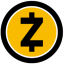

# Best Cryptocurrencies for Privacy Curated by Github Users

Open Source and Always a Work in Progress (WIP)

## Abstract

<!-- annotation: Simply the facts. -->

This technical assessment provides an evidence-based analysis of cryptocurrency privacy protocols. This framework prioritizes empirical analysis via independent security audits, public source code availability, cryptographic design, and default privacy guarantees.

## Methodology

### Evaluation Criteria

Our evaluation considers:

1. **Code Transparency**: Public availability of source code
2. **Independent Verification**: Third party review and audits
3. **Architectural Verifiability**: Privacy by design vs policy
4. **Default Privacy**: Mandatory vs optional privacy
5. **Privacy Architecture**: Technical implementation and cryptographic guarantees

<!-- callout: Ignore the marketing. Read the facts. -->

## Privacy Coin Comparison

| Rank | Cryptocurrency | Source Available | Proof | Default Privacy | Hide Sender | Hide Receiver | Hide Amount | No Trusted Setup | Network Privacy |
|------|----------------|------------------|-------|-----------------|-------------|---------------|-------------|------------------|-----------------|
| 1 |  [Monero](https://www.getmonero.org/) | [✓ Yes](https://github.com/monero-project/monero) | ✓ Yes | ✓ Yes | ✓ Yes | ✓ Yes | ✓ Yes | ✓ Yes | ✓ Yes |
| 2 |  [Zano](https://zano.org/) | [✓ Yes](https://github.com/hyle-team) | ✓ Yes | ✓ Yes | ✓ Yes | ✓ Yes | ✓ Yes | ✓ Yes | ✓ Yes |
| 3 |  [Beam](https://www.beam.mw/) | [✓ Yes](https://github.com/BEAMMW) | ✓ Yes | ✓ Yes | ✓ Yes | ✓ Yes | ✓ Yes | ✓ Yes | ✓ Yes |
| 4 |  [Pirate Chain](https://piratechain.com/) | [✓ Yes](https://github.com/PirateNetwork/pirate) | ✓ Yes | ✓ Yes | ✓ Yes | ✓ Yes | ✓ Yes | [✗ No](https://z.cash/technology/paramgen/) | ✓ Yes |
| 5 |  [Firo](https://firo.org/) | [✓ Yes](https://github.com/firoorg/firo) | ✓ Yes | ✗ No | ✓ Yes | ✓ Yes | ✓ Yes | ✓ Yes | ✓ Yes |
| 6 |  [Zcash](https://z.cash/) | [✓ Yes](https://github.com/zcash/zcash) | ✓ Yes | ✗ No | ✓ Yes | ✓ Yes | ✓ Yes | [✗ No](https://z.cash/technology/paramgen/) | ✗ No |
| 7 |  [Grin](https://grin.mw/) | [✓ Yes](https://github.com/mimblewimble/grin) | ✓ Yes | ✗ No | ✗ No | ✗ No | ✓ Yes | ✓ Yes | ✗ No |
| 8 |  [Dash](https://www.dash.org/) | [✓ Yes](https://github.com/dashpay/dash) | ✓ Yes | ✗ No | ✗ No | ✗ No | ✗ No | ✓ Yes | ✗ No |
| 9 |  [Bitcoin](https://bitcoin.org/) | [✓ Yes](https://github.com/bitcoin/bitcoin) | ✓ Yes | ✗ No | ✗ No | ✗ No | ✗ No | ✓ Yes | ✗ No |
| 10 |  [Ethereum](https://ethereum.org/) | [✓ Yes](https://github.com/ethereum) | ✓ Yes | ✗ No | ✗ No | ✗ No | ✗ No | ✓ Yes | ✗ No |

## Critical Understanding: Architectural vs Policy Based Privacy

### Class 1: Architectural Privacy (Mandatory by Design)

The following cryptocurrencies represent the highest standard of **on-chain** privacy in this comparison. Their blockchains **do not reveal transaction details by default**; any disclosure requires explicit user opt-in (for example, via view/audit keys or off-chain sharing).

- **Monero**: Privacy is mandatory for all transactions through ring signatures, stealth addresses, and RingCT. Battle-tested over 11+ years with no trusted setup required.
- **Zano**: Default-private CryptoNote-based L1 with hidden PoS and confidential assets. No trusted setup required.
- **Beam**: Mimblewimble-based privacy with mandatory confidential transactions and Lelantus-MW for enhanced anonymity sets. No trusted setup required.
- **Pirate Chain**: 100% shielded zk-SNARK transactions with no transparent addresses. Privacy is architecturally enforced but inherits historical trusted setup from Zcash Sapling.

### Class 2: Optional Privacy (User Choice Required)

These cryptocurrencies **offer strong privacy when used**, but require users to actively choose privacy features.

- **Firo**: Lelantus Spark provides strong privacy with large anonymity sets, but not all transactions use private mode.
- **Zcash**: zk-SNARK shielded pool offers exceptional privacy for shielded transactions, but transparent transactions are common. Historical trusted setup ceremonies create supply integrity considerations.

### Class 3: Weak or No Privacy by Default

These cryptocurrencies provide minimal privacy or require external tools.

- **Grin**: Mimblewimble provides some privacy improvements over Bitcoin but vulnerable to network analysis attacks.
- **Dash**: CoinJoin-based PrivateSend is optional and off by default. Base chain is transparent.
- **Bitcoin/Ethereum**: Transparent by default with pseudonymous addresses. Chain analysis is standard industry practice.

## Detailed Cryptocurrency Analysis

### 1. Monero

* **Code transparency:** [Fully published](https://github.com/monero-project/monero)
* **Verification:** Extensive academic research and cryptographic review; primitives iteratively improved
* **Privacy architecture:** Ring signatures hide sender; stealth addresses hide receiver; RingCT hides amounts; Bulletproofs for efficient range proofs
* **Default privacy:** Mandatory for all transactions
* **Trusted setup:** None required
* **What's revealed on-chain:** Nothing (sender, receiver, and amount all hidden)
* **Network privacy:** Dandelion++ for transaction broadcast obfuscation; commonly paired with Tor/I2P, but still subject to known P2P-layer deanonymization limits
* **Operational history:** ~11 years

---

### 2. Zano

* **Code transparency:** [Fully published](https://github.com/hyle-team)
* **Verification:** Growing academic coverage; based on proven CryptoNote primitives
* **Privacy architecture:** dv-CLSAG ring signatures; stealth addresses; Bulletproofs+; hidden-amount PoS (Zarcanum); confidential assets
* **Default privacy:** Mandatory for all transactions and assets
* **Trusted setup:** None required
* **What's revealed on-chain:** Nothing (sender, receiver, amount, and asset type all hidden)
* **Network privacy:** Strong protocol-level protections for transaction data; like other P2P networks, IP metadata still exists unless users add Tor/VPN or similar
* **Operational history:** ~6 years

---

### 3. Beam

* **Code transparency:** [Fully published](https://github.com/BEAMMW)
* **Verification:** Multiple audits; Mimblewimble research base
* **Privacy architecture:** Mimblewimble with Confidential Transactions; Lelantus-MW for larger anonymity sets; Dandelion++ for network privacy; no addresses stored on-chain
* **Default privacy:** Mandatory for all transactions
* **Trusted setup:** None required
* **What's revealed on-chain:** Nothing (amounts and graph structure obscured)
* **Network privacy:** Dandelion++-style broadcast privacy, with known academic attacks against Mimblewimble network-layer anonymity
* **Operational history:** ~7 years

---

### 4. Pirate Chain

* **Code transparency:** [Fully published](https://github.com/PirateNetwork/pirate)
* **Verification:** Inherits Zcash Sapling zk-SNARK research; smaller dedicated literature
* **Privacy architecture:** zk-SNARKs (Sapling) with shielded-only policy; no transparent addresses exist
* **Default privacy:** Mandatory for all transactions (100% shielded)
* **Trusted setup:** Historical SNARK setup ceremony inherited from Zcash (supply integrity consideration, not on-chain data privacy)
* **What's revealed on-chain:** Nothing (sender, receiver, and amount all hidden)
* **Network privacy:** Strong on-chain confidentiality; network metadata depends on wallet/node configuration (e.g., Tor/VPN)
* **Operational history:** ~7 years

---

### 5. Firo

* **Code transparency:** [Fully published](https://github.com/firoorg/firo)
* **Verification:** Lelantus Spark audited by HashCloak (and additional independent review)
* **Privacy architecture:** Lelantus Spark with burn-and-redeem anonymity; large anonymity sets; Spark Assets for private tokens; Dandelion++ for network privacy
* **Default privacy:** Optional (strong privacy available but not enforced)
* **Trusted setup:** None required for Spark
* **What's revealed on-chain:** Depends on transaction type (transparent or Spark)
* **Network privacy:** Dandelion++ transaction relay at the network layer; improves IP-level privacy but shares generic Dandelion++ limitations
* **Operational history:** ~9 years (launched 2016 as Zcoin)

---

### 6. Zcash

* **Code transparency:** [Fully published](https://github.com/zcash/zcash)
* **Verification:** Extensively studied zk-SNARK implementation with multiple audits
* **Privacy architecture:** Dual address system (t-addresses transparent, z-addresses shielded); zk-SNARKs hide sender, receiver, and amount for shielded transactions; Orchard + Halo2 (NU5) eliminates new trusted setups
* **Default privacy:** Optional (users must choose shielded transactions)
* **Trusted setup:** Historical multi-party ceremonies for Sprout/Sapling pools (supply integrity consideration)
* **What's revealed on-chain:** Depends on transaction type; many transactions historically transparent
* **Network privacy:** No built-in network-layer anonymity; both transparent and shielded transactions rely on standard P2P networking unless users add Tor/VPN or similar
* **Operational history:** ~9 years

---

### 7. Grin

* **Code transparency:** [Fully published](https://github.com/mimblewimble/grin)
* **Verification:** Mimblewimble subject to known privacy analyses
* **Privacy architecture:** Mimblewimble with Confidential Transactions and aggregate signatures; history compression through cut-through
* **Default privacy:** Amounts hidden; sender/receiver linkability vulnerable to network analysis
* **Trusted setup:** None required
* **What's revealed on-chain:** Transaction graph partially obscured but vulnerable to monitoring attacks
* **Network privacy:** Uses Dandelion/Dandelion++-style relay but still considered weak; research has demonstrated practical network-level deanonymization
* **Operational history:** ~7 years

---

### 8. Dash

* **Code transparency:** [Fully published](https://github.com/dashpay/dash)
* **Verification:** Analyzed by blockchain forensics companies
* **Privacy architecture:** Optional CoinJoin-based PrivateSend through masternode network
* **Default privacy:** Off (must explicitly enable PrivateSend)
* **Trusted setup:** None required
* **What's revealed on-chain:** Full transparency unless PrivateSend used; mixing weaker than mandatory privacy coins
* **Network privacy:** Minimal; standard transparent blockchain
* **Operational history:** ~11 years

---

### 9. Bitcoin

* **Code transparency:** [Fully published](https://github.com/bitcoin/bitcoin)
* **Verification:** Most heavily reviewed cryptocurrency code
* **Privacy architecture:** Transparent UTXO ledger with pseudonymous addresses
* **Default privacy:** None (fully transparent)
* **Trusted setup:** None required
* **What's revealed on-chain:** All transaction details visible; address clustering and chain analysis standard
* **Network privacy:** Minimal; IP addresses linkable to transactions without precautions
* **Operational history:** ~16 years

---

### 10. Ethereum

* **Code transparency:** [Fully published](https://github.com/ethereum)
* **Verification:** Extensive research and audit ecosystem
* **Privacy architecture:** Transparent account-based model; all contract calls and state changes public
* **Default privacy:** None (fully transparent)
* **Trusted setup:** None at L1; privacy only via external tools (mixers, zk-rollups)
* **What's revealed on-chain:** All wallet activity, token transfers, and contract interactions visible
* **Network privacy:** Minimal; requires external privacy solutions
* **Operational history:** ~10 years

## Conclusion

Monero, Zano, and Beam represent the gold standard for cryptocurrency privacy through mandatory default privacy and no trusted setup requirements. Monero's 11+ years of operation and extensive cryptographic scrutiny make it one of the most battle-tested privacy coins.

Pirate Chain offers exceptional privacy through 100% shielded transactions but inherits supply integrity considerations from its historical trusted setup ceremony.

Optional privacy coins like Zcash and Firo provide strong cryptographic privacy when used but suffer from reduced anonymity sets due to transparent transaction options.

Bitcoin and Ethereum, while foundational to cryptocurrency, provide no meaningful privacy by default and require external tools for any privacy guarantees.

<!-- navigation -->
[Abstract](#abstract) [Methodology](#methodology) [Comparison](#privacy-coin-comparison) [Categories](#critical-understanding-architectural-vs-policy-based-privacy) [Details](#detailed-cryptocurrency-analysis) [Conclusion](#conclusion)

## Footer

A public service by the users of Github.
