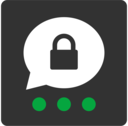
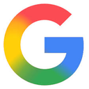

# Best Messaging Apps Curated by Github Users

Open Source and Always a Work in Progress (WIP)

## Abstract

<!-- annotation: Simply the facts. -->

This technical assessment provides an evidence-based analysis of messaging applications across the full privacy spectrum: text, voice, video, metadata exposure, IP protection, and identity requirements. In contrast to popularity-based rankings, this framework prioritizes verifiable cryptographic privacy through code transparency, independent audits, and operational architecture.

## Methodology

<!-- annotation: Evidence-based evaluation. -->

### Evaluation Criteria

Our evaluation considers:

1. **Code Transparency**: Public availability of client and server source code
2. **Independent Audit**: Third party security audits and cryptographic reviews
3. **End-to-End Encryption**: Default E2EE for text, voice, and video
4. **IP Protection**: Whether peers or servers can see user IP addresses
5. **Identity Requirements**: Phone number or real name registration
6. **Metadata Protection**: Visibility of contacts, timestamps, and routing information
7. **Federation**: Distributed trust versus centralized backend
8. **Operational Verifiability**: Whether privacy properties are proven by design

<!-- callout: Ignore the marketing. Read the facts. -->

## Messaging App Comparison

| Rank | Service | Open Source | Audited | Text E2EE | Voice E2EE | Video E2EE | Phone Required | IP Protected |
|------|---------|-------------|---------|-----------|------------|------------|----------------|--------------|
| 1 |  [Signal](https://signal.org/) | [✓ Yes](https://github.com/signalapp) | [✓ Yes](https://explore.openalex.org/works/w2566711147) | ✓ Yes | ✓ Yes | ✓ Yes | ✓ Yes | ✓ Yes (optional relay) |
| 2 |  [Threema](https://threema.ch/) | [✓ Yes (clients only)](https://github.com/threema-ch) | [✓ Yes](https://threema.com/en/faq/code-audit) | ✓ Yes | ✓ Yes | ✓ Yes | ✗ No | ✓ Yes (optional relay; P2P default) |
| 3 |  [Wire](https://wire.com/) | [✓ Yes](https://github.com/wireapp) | ✓ Yes | ✓ Yes | ✓ Yes | ✓ Yes | ✗ No | ✓ Yes |
| 4 |  [iMessage](https://support.apple.com/messages) | ✗ No | ✓ Yes (limited) | ✓ Yes | ✓ Yes | ✓ Yes | ✗ No | ✗ No (P2P; IP exposed to peers) |
| 5 |  [Matrix/Element](https://matrix.org/) | [✓ Yes](https://github.com/matrix-org) | [✓ Yes](https://matrix.org/blog/2016/11/21/matrix-s-olm-end-to-end-encryption-security-assessment-released-and-implemented-cross-platform-on-riot-at-last/) | ✓ Yes (per-room) | ✓ Yes | ✓ Yes | ✗ No | ✓ Yes (needs TURN) |
| 6 |  [Session](https://getsession.org/) | [✓ Yes](https://github.com/oxen-io) | [✓ Yes](https://blog.quarkslab.com/resources/2021-05-04_audit-of-session-secure-messaging-application/20-08-Oxen-REP-v1.4.pdf) | ✓ Yes | ✓ Yes (beta) | ✓ Yes (beta) | ✗ No | ✓ Yes |
| 7 |  [Briar](https://briarproject.org/) | [✓ Yes](https://code.briarproject.org/briar/briar) | [✓ Yes](https://briarproject.org/news/2018-1.0-released-new-funding/) | ✓ Yes | ✗ No | ✗ No | ✗ No | ✓ Yes |
| 8 |  [IRC (Self-Hosted + OTR/FiSH)](https://en.wikipedia.org/wiki/Internet_Relay_Chat) | ✓ Protocol | ✗ No | ✓ Yes (plugins) | ✗ No | ✗ No | ✗ No | ✓ Yes (server-dependent) |
| 9 |  [Telegram](https://telegram.org/) | [✓ Yes (clients only)](https://github.com/DrKLO/Telegram) | [✓ Yes (limited)](https://eprint.iacr.org/2017/1393.pdf) | ✓ Yes (optional) | ✓ Yes | ✓ Yes | ✓ Yes | ✗ No (P2P default) |
| 10 |  [RCS/Google Messages](https://messages.google.com/) | ✗ No (client proprietary) | ✗ No (limited) | ✓ Yes (Google only) | ✗ No | ✗ No | ✓ Yes | ✗ No |
| 11 |  [Facebook Messenger](https://www.messenger.com/) | ✗ No | ✗ No | ✓ Yes (default) | ✓ Yes (default) | ✓ Yes (default) | ✗ No | ✗ No |
| 12 |  [SMS/MMS](https://en.wikipedia.org/wiki/SMS) | ✓ Protocol | ✗ No | ✗ No | ✗ No | ✗ No | ✓ Yes | ✗ No |

## Critical Understanding: Cryptographic vs Policy-Based Privacy

### Class 1: Full-Stack Cryptographic Privacy

The following messaging apps provide end-to-end encryption across **all communication channels** by design.

- **Signal**: Audited Signal Protocol. Mandatory E2EE for text, voice, and video. Calls are P2P by default (exposes IP) but can enable relay option.
- **Threema**: Swiss jurisdiction. No phone number required. E2EE across all channels with reproducible builds and independent audits. Apps open source; server proprietary. Voice/video calls are P2P by default but can be relayed via Threema’s servers to hide IPs.
- **Wire**: Enterprise-grade E2EE for text, voice, and video. Clients and server open source (GPL/AGPL) with strong cryptographic implementation.
- **iMessage/FaceTime**: Apple's E2EE implementation across all channels. Closed source but strong cryptographic design. Metadata retained by Apple. FaceTime typically uses peer-to-peer media, so IP addresses are visible to call participants.

### Class 2: Text-Private, Limited VoIP

These applications provide exceptional text privacy. Voice/video features are emerging or absent.

- **Matrix/Element**: Federated E2EE protocol. Open source and audited. E2EE enabled per-room (often default for private rooms). IP protection requires TURN server configuration.
- **Session**: Anonymous messenger with onion routing. No phone number or IP metadata collection by design. Quarkslab-audited. Voice/video calling in beta (opt-in).
- **Briar**: Metadata-free, off-grid capable using Tor/Bluetooth/WiFi Direct. OTF-audited. No voice/video features.

### Class 3: Optional or Incomplete E2EE

Applications where encryption is not default or applies only to specific communication types.

- **IRC (Self-Hosted + OTR/FiSH)**: Open protocol. Can be extremely private with proper configuration (OTR/FiSH plugins for encryption). No voice/video support.
- **Telegram**: Default chats not E2EE. Secret chats provide E2EE but may expose IP addresses through P2P connections (can be disabled). Academic analysis has identified cryptographic issues in MTProto.
- **RCS/Google Messages**: E2EE for 1:1 and groups between Google Messages users. Cross-platform E2EE (Android–iOS) is deploying via the GSMA MLS standard. Metadata visible to carriers and Google.
- **Facebook Messenger**: E2EE now default for personal chats and calls (since Dec 2023), but extensive metadata still logged.
- **SMS/MMS**: No encryption. Plaintext visible to carriers, MVNOs, and governments. Zero confidentiality.

## Detailed Service Analysis

### 1. Signal

* **Code transparency:** [Fully open source](https://github.com/signalapp)
* **Independent audit:** [Signal Protocol academically analyzed and verified](https://explore.openalex.org/works/w2566711147)
* **Org transparency:** [Fully disclosed](https://signalfoundation.org/)
* **Privacy architecture:** Mandatory E2EE for all messages; calls are P2P by default (exposes IP to contacts) but can enable "Always relay calls" setting to hide IP
* **Text E2EE:** Yes (always enabled)
* **Voice E2EE:** Yes (always enabled)
* **Video E2EE:** Yes (always enabled)
* **Phone number required:** Yes (but users can share usernames instead and hide number discoverability)
* **What's logged (by policy):** [Phone number, account creation timestamp, and last connection date; no message content, contacts, or groups](https://signal.org/bigbrother/)
* **Anonymous usage:** Requires phone number but minimal metadata; username sharing available
* **Operational history:** ~11 years

---

### 2. Threema

* **Code transparency:** [Apps open source; server proprietary](https://github.com/threema-ch)
* **Independent audit:** [Multiple Cure53 audits](https://threema.com/en/security/audits)
* **Org transparency:** [Fully disclosed](https://threema.ch/en/about)
* **Privacy architecture:** Swiss jurisdiction; no phone number requirement; reproducible builds. Voice/video calls are P2P by default, with an option to always route calls via Threema servers to obscure IP addresses.
* **Text E2EE:** Yes (always enabled)
* **Voice E2EE:** Yes (always enabled)
* **Video E2EE:** Yes (always enabled)
* **Phone number required:** No
* **What's logged (by policy):** Minimal, non-persistent metadata
* **Anonymous usage:** Yes (can purchase anonymously)
* **Operational history:** ~12 years

---

### 3. Wire

* **Code transparency:** [Clients and server open source (GPL/AGPL)](https://github.com/wireapp)
* **Independent audit:** [Kudelski and X-41 app-level audits](https://wire.com/en/security/)
* **Org transparency:** [Fully disclosed](https://wire.com/en/about/)
* **Privacy architecture:** Enterprise-focused E2EE across all channels; commercial hosting available
* **Text E2EE:** Yes (always enabled)
* **Voice E2EE:** Yes (always enabled)
* **Video E2EE:** Yes (always enabled)
* **Phone number required:** No
* **What's logged (by policy):** Minimal metadata; EU jurisdiction
* **Anonymous usage:** Email required but no phone number
* **Operational history:** ~11 years

---

### 4. iMessage / FaceTime

* **Code transparency:** Proprietary
* **Independent audit:** Limited third-party analysis
* **Org transparency:** [Fully disclosed](https://www.apple.com/)
* **Privacy architecture:** E2EE for all Apple-to-Apple communication; closed ecosystem. FaceTime calls use peer-to-peer media where possible, which exposes IP addresses to call participants; there is no in-app relay toggle.
* **Text E2EE:** Yes (between Apple devices)
* **Voice E2EE:** Yes (FaceTime calls; P2P media reveals IPs to peers)
* **Video E2EE:** Yes (FaceTime calls; P2P media reveals IPs to peers)
* **Phone number required:** No (Apple ID)
* **What's logged (by policy):** [Metadata retained by Apple; iCloud backups can weaken E2EE unless Advanced Data Protection is enabled](https://support.apple.com/en-us/102651)
* **Anonymous usage:** Requires Apple ID
* **Operational history:** ~14 years (iMessage), ~19 years (FaceTime)

---

### 5. Matrix / Element

* **Code transparency:** [Fully open source](https://github.com/matrix-org)
* **Independent audit:** [NCC Group security assessment](https://matrix.org/blog/2022/09/13/matrix-protocol-security-assessment-2022-ncc-group/)
* **Org transparency:** [Fully disclosed](https://matrix.org/about/)
* **Privacy architecture:** Federated E2EE protocol; homeserver sees routing metadata
* **Text E2EE:** Per-room (often enabled by default for new private rooms and DMs)
* **Voice E2EE:** Yes (TURN recommended to avoid direct IP exposure via STUN/P2P)
* **Video E2EE:** Yes (TURN recommended to avoid direct IP exposure via STUN/P2P)
* **Phone number required:** No
* **What's logged (by policy):** Routing metadata visible to homeserver operators
* **Anonymous usage:** Yes (can self-host)
* **Operational history:** ~11 years

---

### 6. Session

* **Code transparency:** [Fully open source](https://github.com/oxen-io)
* **Independent audit:** [Quarkslab security assessment (2021)](https://blog.quarkslab.com/audit-of-session-secure-messaging-application.html)
* **Org transparency:** [Partially disclosed](https://getsession.org/)
* **Privacy architecture:** Onion routing; no phone number or IP metadata collection by design; network nodes see IPs transiently but the system is designed to avoid logging them.
* **Text E2EE:** Yes (always enabled)
* **Voice E2EE:** Beta (opt-in feature)
* **Video E2EE:** Beta (opt-in feature)
* **Phone number required:** No
* **What's logged (by policy):** No identifying metadata
* **Anonymous usage:** Yes (fully anonymous)
* **Operational history:** ~6 years

---

### 7. Briar

* **Code transparency:** [Fully open source](https://code.briarproject.org/briar/briar)
* **Independent audit:** [Open Technology Fund security audit (2023–24)](https://www.opentech.fund/results/supported-projects/briar/)
* **Org transparency:** [Community project](https://briarproject.org/about.html)
* **Privacy architecture:** Metadata-free; Tor/Bluetooth/WiFi Direct transport; no central servers
* **Text E2EE:** Yes (always enabled)
* **Voice E2EE:** Not supported
* **Video E2EE:** Not supported
* **Phone number required:** No
* **What's logged (by policy):** No server; no logs
* **Anonymous usage:** Yes (fully anonymous)
* **Operational history:** ~7 years

---

### 8. IRC (Self-Hosted + OTR/FiSH)

* **Code transparency:** Open protocol standard
* **Independent audit:** No (protocol level)
* **Org transparency:** Decentralized; various implementations
* **Privacy architecture:** Pseudonymous; E2EE only with OTR or FiSH (Blowfish) plugins; self-hostable
* **Text E2EE:** Only with OTR/FiSH plugins
* **Voice E2EE:** Not supported
* **Video E2EE:** Not supported
* **Phone number required:** No
* **What's logged (by policy):** Server sees metadata; minimal when self-hosted; E2EE only end-to-end via plugins
* **Anonymous usage:** Yes (pseudonymous)
* **Operational history:** ~36 years

---

### 9. Telegram

* **Code transparency:** [Clients open source; server proprietary](https://github.com/DrKLO/Telegram)
* **Independent audit:** [Limited academic analysis](https://eprint.iacr.org/2017/1393.pdf)
* **Org transparency:** [Partially disclosed](https://telegram.org/about)
* **Privacy architecture:** Default chats not E2EE; secret chats use MTProto protocol
* **Text E2EE:** Optional (secret chats only)
* **Voice E2EE:** Yes (but IP exposed via P2P by default; can disable P2P to force relay)
* **Video E2EE:** Yes (but IP exposed via P2P by default; can disable P2P to force relay)
* **Phone number required:** Yes
* **What's logged (by policy):** [Extensive metadata for default chats](https://telegram.org/privacy)
* **Anonymous usage:** No
* **Operational history:** ~12 years

---

### 10. RCS / Google Messages

* **Code transparency:** Client app (Google Messages) is proprietary; RCS protocol itself is a public GSMA standard.
* **Independent audit:** Limited (no public end-to-end security audit of Google’s implementation)
* **Org transparency:** [Google and carrier consortium](https://blog.google/products/rcs/delivering-rcs-messaging-android-users-worldwide/)
* **Privacy architecture:** E2EE for 1:1 and group chats when all participants use Google Messages with RCS enabled; metadata visible to carriers and Google. GSMA’s MLS-based Universal Profile enables cross-platform (Android–iOS) E2EE, which is in the process of rolling out.
* **Text E2EE:** Yes (1:1 and groups via Google Messages; cross-platform E2EE deployment in progress)
* **Voice E2EE:** No
* **Video E2EE:** No
* **Phone number required:** Yes
* **What's logged (by policy):** [Extensive carrier and Google metadata](https://policies.google.com/privacy)
* **Anonymous usage:** No
* **Operational history:** ~17 years (protocol), E2EE rollout since ~2020

---

### 11. Facebook Messenger

* **Code transparency:** Proprietary
* **Independent audit:** No
* **Org transparency:** [Fully disclosed](https://www.meta.com/)
* **Privacy architecture:** E2EE default for personal chats and calls since Dec 2023; designed for data collection and ad targeting
* **Text E2EE:** Yes (default for personal chats since Dec 2023)
* **Voice E2EE:** Yes (default for personal calls since Dec 2023)
* **Video E2EE:** Yes (default for personal calls since Dec 2023)
* **Phone number required:** No (Facebook account)
* **What's logged (by policy):** [Extensive metadata still collected despite E2EE](https://www.facebook.com/privacy/policy/)
* **Anonymous usage:** No
* **Operational history:** ~15 years

---

### 12. SMS / MMS

* **Code transparency:** Open protocol standard
* **Independent audit:** No
* **Org transparency:** Telecom carrier controlled
* **Privacy architecture:** No encryption; plaintext visible to carriers, MVNOs, and governments
* **Text E2EE:** No
* **Voice E2EE:** Not applicable
* **Video E2EE:** Not applicable
* **Phone number required:** Yes
* **What's logged (by policy):** All message content and metadata visible to carriers and law enforcement
* **Anonymous usage:** No
* **Operational history:** ~32 years (SMS), ~25 years (MMS)

## Conclusion

Signal and Threema represent the strongest privacy-first messaging platforms with full E2EE across text, voice, and video. Signal's audited protocol provides excellent privacy, though calls are P2P by default (exposing IP addresses to contacts unless "Always relay calls" is enabled). Users comfortable with phone number registration can share via usernames instead. Threema offers similar security without phone number requirements, making it ideal for maximum anonymity, though its server code is proprietary while apps are open source and call IP protection depends on enabling relaying.

Wire provides enterprise-grade E2EE with both clients and server open source under GPL/AGPL licenses, offering strong cryptographic implementation across all channels.

For users prioritizing open source and federation, Matrix/Element provides decentralized E2EE communication with proper TURN configuration to prevent IP leaks. Encryption is enabled per-room, often by default for new private rooms and DMs. Session excels at metadata protection and anonymity with onion routing and has been independently audited by Quarkslab. It now offers voice/video calls in beta (opt-in). Briar, audited by Open Technology Fund, remains the strongest choice for off-grid, metadata-free communication but lacks voice/video entirely.

IRC with proper OTR or FiSH (Blowfish) configuration can provide strong text privacy with pseudonymous usage, though it requires technical expertise and lacks voice/video support. When properly configured with self-hosting and encryption plugins, IRC can exceed the privacy of Telegram and RCS.

Facebook Messenger now provides default E2EE for personal chats and calls (since December 2023), representing a significant improvement. However, extensive metadata collection continues, and the platform's business model remains advertising-focused. Telegram provides E2EE only for secret chats, and academic analysis has identified cryptographic issues in MTProto. Calls expose IP addresses through P2P by default (users can disable P2P to force relay). RCS now offers E2EE for both 1:1 and group conversations between Google Messages users, with cross-platform E2EE (Android–iOS) deploying via the GSMA MLS standard.

SMS/MMS represents the worst communication privacy available, with zero encryption and complete visibility to carriers, MVNOs, and government agencies. It should never be used for private communications.

The choice between messaging platforms depends on threat model: Signal/Threema/Wire for verified secure communication across all channels (with Signal and Threema optionally relaying calls for better IP protection), Matrix for decentralized control, Session for maximum metadata protection with emerging calling features and verified audit, Briar for off-grid communication with verified audit, and properly configured IRC for pseudonymous text-only communication. SMS/MMS should be avoided entirely for any sensitive communication.

<!-- navigation -->
[Abstract](#abstract) [Methodology](#methodology) [Comparison](#messaging-app-comparison) [Categories](#critical-understanding-cryptographic-vs-policy-based-privacy) [Details](#detailed-service-analysis) [Conclusion](#conclusion)

## Footer

A public service by the users of Github.
