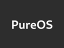

# Best Operating Systems for Privacy Curated by GitHub Users

Open Source and Always a Work in Progress (WIP)

## Abstract

This technical assessment ranks desktop operating systems according to architectural privacy rather than usability or popularity. The evaluation concentrates on code transparency, the degree of independent scrutiny the platform receives, telemetry behavior, the structure of the network privacy model, the system’s approach to isolation and compartmentalization, and the ways in which metadata is exposed. It also considers which privacy properties can be verified. The list distinguishes between privacy, security, anonymity, and auditability, since different operating systems are designed to address different threat models rather than a single uniform goal.

---

<!-- navigation -->
[Abstract](#abstract) [Methodology](#methodology) [Comparison](#operating-system-comparison-2025) [Privacy Architectures](#critical-understanding-privacy-architectures) [Details](#detailed-service-analysis) [Conclusion](#conclusion)

## Methodology

### Evaluation Criteria

Our evaluation considers:

1. **Code Transparency**: Kernel and userland availability for inspection.  
2. **Independent Audit / Scrutiny**: Formal audits or long-term peer review.  
3. **Privacy Architecture**: Isolation, Tor routing, minimal surface, or amnesic design.  
4. **Default Telemetry (out-of-box)**: What is sent "home" without additional configuration.  
5. **Metadata Protection**: External visibility of identifiers, DNS, IP, usage, activity.  
6. **Isolation Capabilities**: Sandboxing, compartmentalization, and attack surface reduction.
7. **Operational Verifiability**: Ability to audit behavior and trust boundaries.

---

## Operating System Comparison (2025)

### Ranked strictly by privacy-by-design (strongest → weakest)

| Rank | Operating System | Open Source | Independent Audit / Scrutiny | Privacy Architecture | Default Telemetry (out-of-box) | Metadata Protected | Notes |
|------|------------------|-------------|------------------------------|----------------------|-------------------------------|--------------------|-------|
| 1 |  [Qubes OS](https://www.qubes-os.org/) | Kernel & userland mostly open; some proprietary firmware | Strong community review; used in audited systems | ✓ Strong | None (no distro-level phone-home) | Strong within compartment boundaries | Best architecture for privacy & isolation. |
| 2 |  [Whonix](https://www.whonix.org/) | ✓ Yes | Long-term public scrutiny, Tor community review | ✓ Strong Tor-only gateway / workstation split | None beyond Tor network traffic | Strong for IP / DNS metadata | Best persistent anonymity OS. |
| 3 |  [Tails](https://tails.net/) | ✓ Yes | External audits of critical components plus community review | ✓ Amnesic, Tor-only | None beyond Tor network traffic | Strong for local traces; Tor for network | For ephemeral anonymous sessions. |
| 4 |  [OpenBSD](https://www.openbsd.org/) | ✓ Yes | Long-term proactive code auditing | ✓ Minimal, secure-by-default base | None | Strong (no background connections) | Most secure general-purpose OS. |
| 5 |  [PureOS](https://pureos.net/) | ✓ Yes (FSF-endorsed 100% free software) | Based on Debian; community review | ✓ Privacy-respecting defaults | None by default | Depends on config | Strong no-telemetry Linux. |
| 6 |  [Debian](https://www.debian.org/) | ✓ Yes | Long-term community review | ✓ Solid base (when minimal & free-only) | None (popcon is opt-in) | Depends on config | Foundation of Tails/Whonix/PureOS. |
| 7 |  [Arch Linux](https://archlinux.org/) | ✓ Yes | Community review | ✓ Minimal base; user-built | None | Depends on config | Excellent when hardened manually. |
| 8 |  [FreeBSD](https://www.freebsd.org/) | ✓ Yes | Long-lived community review (less than OpenBSD) | ✓ Strong isolation primitives (jails) | None | Depends on config | Great for servers; desktop privacy requires tuning. |
| 9 |  [Ubuntu](https://ubuntu.com/) | Mostly open source | Limited formal audits | ✓ General-purpose with optional hardening | Limited system info & crash reports; some metrics enabled unless you opt out | Depends on config | Privacy acceptable only after configuration. |
| 10 |  [macOS](https://www.apple.com/macos/) | ✗ No | Internal audits; external research only | ✓ Strong local security; ecosystem-centric | Optional analytics and usage data; prompted during setup and configurable in settings | ✗ Sensitive metadata flows via Apple ecosystem | Strong local security, mixed privacy posture. |
| 11 |  [Omarchy](https://omarchy.org/) | ✓ Yes (configs + Arch base) | ✗ No formal security audits | ✗ Not privacy-focused; dev-workflow focused | None at OS level (inherits Arch’s no-telemetry base); security defaults criticized | ✗ Weak by default unless hardened | Not privacy-focused; insecure defaults have been criticized. |
| 12 |  [Windows](https://www.microsoft.com/windows/) | ✗ No | Corporate compliance & internal audits | ✗ Centralized, identity-linked ecosystem | Required diagnostic data cannot be fully disabled; optional data adds more | ✗ Extensive | Worst default privacy posture. |

---

## Critical Understanding: Privacy Architectures

### Class 1: Built for Privacy

The following operating systems represent architectures **engineered for privacy**:

- **Qubes OS**: Compartmentalized VM isolation prevents data leakage across security domains.
- **Whonix**: Tor-only routing with gateway/workstation split prevents IP leaks.
- **Tails**: Amnesic design with Tor-only networking ensures no persistent traces.

### Class 2: Minimalist, Security-First

These operating systems provide strong security foundations for privacy:

- **OpenBSD**: Minimal attack surface with proactive security auditing.
- **Debian minimal / PureOS**: Highly configurable secure base.
- **Arch minimal**: Power-user privacy when properly hardened.

### Class 3: General-Purpose but Not Privacy-First

- **FreeBSD, Ubuntu**: Capable but require significant privacy configuration.

### Class 4: Closed Vendor Ecosystems

- **macOS, Windows**: Proprietary with extensive ecosystem-level tracking and cloud integration.

### Class 5: Non-Hardened Distros

- **Omarchy**: Community-criticized for weak security defaults; aims at fast developer onboarding rather than privacy.

---

## Detailed Service Analysis

### 1. Qubes OS

* **Code transparency:** Kernel and userland are open source; project documentation notes some necessary proprietary firmware (e.g., CPU microcode and other blobs) are still required for modern hardware.
* **Independent audit / scrutiny:** Heavy academic and industry scrutiny; used as the base in systems that themselves undergo third-party audits.
* **Privacy architecture:** Xen hypervisor VM isolation; disposable VMs; strict compartmentalization (“security by compartmentalization”).
* **Default telemetry:** None at the distro level; no built-in phone-home services.
* **Metadata protection:** Strong at the compartment level (VM boundaries prevent cross-domain visibility); network metadata still governed by how you route traffic (e.g., Tor/VPN qubes).
* **Isolation capabilities:** Full VM isolation per application or domain; qrexec policy framework to control cross-VM actions.
* **Update privacy:** No proprietary tracking IDs; uses standard distribution repositories (Fedora/Debian templates) which still see normal connection metadata like IPs.
* **Operational history:** First release in 2012 (~13 years of operation as of 2025).

---

### 2. Whonix (VM / Qubes-Whonix)

* **Code transparency:** Fully open-source Debian-based system.
* **Independent audit / scrutiny:** Long-standing public scrutiny from Tor researchers and privacy community.
* **Privacy architecture:** Two-VM split (Tor Gateway + isolated Workstation); all traffic from the workstation is forced through Tor.
* **Default telemetry:** None beyond what Tor itself transmits by design.
* **Metadata protection:** Strong for IP and DNS (workstation cannot directly reach clearnet).
* **Isolation capabilities:** VM-based separation; supports AppArmor and other Linux hardening.
* **Update privacy:** All updates flow through Tor.
* **Operational history:** Founded in 2012 (~13 years as of 2025).

---

### 3. Tails

* **Code transparency:** Fully open-source, Debian-based.
* **Independent audit / scrutiny:** Critical components (like automatic upgrades and persistence) have undergone external audits, plus long-term community review.
* **Privacy architecture:** Amnesic live OS; Tor-only networking; non-Tor connections are blocked by default.
* **Default telemetry:** None; all network traffic is forced through Tor, and there is no install-time or usage tracking beyond Tor’s own design.
* **Metadata protection:** Strong (no local logs by default; persistence only when explicitly enabled; Tor for network metadata).
* **Isolation capabilities:** AppArmor sandboxing and other kernel hardening features.
* **Update privacy:** Through Tor only; no centralized user accounts.
* **Operational history:** First released in 2009 (~16 years as of 2025).

---

### 4. OpenBSD

* **Code transparency:** Completely open-source.
* **Independent audit / scrutiny:** Famous for continuous, manual code auditing focused on correctness and security.
* **Privacy architecture:** Minimal default services; “secure by default”; pledge/unveil system call restrictions.
* **Default telemetry:** None; no automatic connections home.
* **Metadata protection:** Strong in the sense that the base system does not create extra background traffic that leaks metadata.
* **Isolation capabilities:** pledge/unveil, W^X, privilege separation patterns throughout the base system.
* **Update privacy:** Uses standard repository infrastructure without user accounts or custom tracking.
* **Operational history:** Project began in 1995 (~30 years as of 2025).

---

### 5. PureOS

* **Code transparency:** 100% free software, endorsed by the Free Software Foundation; all included software is auditable.
* **Independent audit / scrutiny:** Built on Debian’s well-reviewed ecosystem; additional scrutiny from the FSF’s endorsement process and privacy-focused communities.
* **Privacy architecture:** Privacy-respecting defaults; emphasis on freedom and the absence of proprietary blobs.
* **Default telemetry:** None by default.
* **Metadata protection:** Depends on user configuration (e.g., whether Tor/VPN or hardened DNS is used).
* **Isolation capabilities:** AppArmor and optional sandboxing frameworks.
* **Update privacy:** No user tracking; standard Debian-style package distribution.
* **Operational history:** Publicly released mid-2010s (~8–10 years depending on how you count early milestones).

---

### 6. Debian (Minimal Install)

* **Code transparency:** Fully open-source when installed without non-free repositories.
* **Independent audit / scrutiny:** One of the most widely reviewed distros; long-term community and downstream scrutiny.
* **Privacy architecture:** Stable, minimal base when installed without extras; many privacy choices left to the user.
* **Default telemetry:** None by default; the “popularity-contest” package is opt-in.
* **Metadata protection:** Strong or weak depending entirely on user configuration (firewalling, DNS choices, Tor/VPN, etc.).
* **Isolation capabilities:** AppArmor and various sandboxing tools are available.
* **Update privacy:** Standard mirror-based updates; no accounts or tracking IDs.
* **Operational history:** Founded in 1993 (~32 years as of 2025).

---

### 7. Arch Linux (Minimal Install)

* **Code transparency:** Fully open-source base; encourages minimalism and explicit choices.
* **Independent audit / scrutiny:** Community review and constant usage across many derivatives.
* **Privacy architecture:** Minimal base system; you choose what to install, including every network-facing component.
* **Default telemetry:** None from the base system.
* **Metadata protection:** Completely dependent on how the user configures networking, browsers, and applications.
* **Isolation capabilities:** Can use AppArmor, SELinux, or other MAC frameworks but none are enforced by default.
* **Update privacy:** Uses standard package mirrors; no accounts or proprietary tracking IDs.
* **Operational history:** First formal release in 2002 (~23 years as of 2025).

---

### 8. FreeBSD

* **Code transparency:** Entire base system is open-source.
* **Independent audit / scrutiny:** Long history and broad deployment; generally less security-obsessed than OpenBSD but still well-reviewed.
* **Privacy architecture:** Capsicum capabilities, jails, and a minimal base provide strong primitives for isolation.
* **Default telemetry:** None from the base system.
* **Metadata protection:** Depends heavily on how services and applications are configured.
* **Isolation capabilities:** Jails, Capsicum, and other kernel features offer strong compartmentalization when used.
* **Update privacy:** Uses FreeBSD mirrors without per-user tracking.
* **Operational history:** First release in 1993 (~32 years as of 2025).

---

### 9. Ubuntu (Minimal Install)

* **Code transparency:** Mostly open source; proprietary drivers and snaps are available and often encouraged.
* **Independent audit / scrutiny:** Limited formal audits; heavy community and enterprise usage.
* **Privacy architecture:** General-purpose desktop with optional hardening; defaults optimized for convenience and hardware support.
* **Default telemetry:**  
  * Install-time system information is sent to Canonical unless you opt out on the “Help improve Ubuntu” screen.  
  * Crash reporting and some usage metrics may be enabled unless disabled.
* **Metadata protection:** Depends on user choices (browsers, snaps, online accounts, etc.).
* **Isolation capabilities:** AppArmor is enabled; Snap packages run in sandboxes.
* **Update privacy:** Uses Canonical infrastructure and mirrors; no per-user accounts required for updates.
* **Operational history:** First version released in 2004 (~21 years as of 2025).

---

### 10. macOS

* **Code transparency:** Mostly closed-source; built on an open-source Darwin base but the full OS is proprietary.
* **Independent audit / scrutiny:** No full independent OS audit; extensive external security research plus Apple’s own internal audits.
* **Privacy architecture:** Strong local security model (code signing, sandboxing, integrated disk encryption) but tightly integrated with Apple’s cloud ecosystem (iCloud, ID-linked services).
* **Default telemetry:** Analytics and usage data are controlled by user consent via setup and Privacy → Analytics & Improvements; many users leave at least some of these enabled.
* **Metadata protection:** Weak at the ecosystem level; heavy reliance on Apple ID and cloud makes metadata aggregation easy.
* **Isolation capabilities:** App sandboxing, hardened runtime, code signing, and TCC (Transparency, Consent, and Control) for permissions.
* **Update privacy:** Updates are tied to Apple infrastructure and, in many cases, to Apple IDs and device identifiers.
* **Operational history:** Mac OS X 10.0 “Cheetah” released in 2001 (~24 years as of 2025).

---

### 11. Omarchy (Arch-based)

* **Code transparency:** Arch + Hyprland base and Omarchy configs are open source under permissive licensing.
* **Independent audit / scrutiny:** No formal security audit; communityfeedback and code review only.
* **Privacy architecture:** Not privacy-focused; designed as an “omakase” developer environment with many preconfigured, sometimes proprietary, tools.
* **Default telemetry:** No additional OS-level telemetry beyond what a standard Arch system and chosen applications do; however, some preinstalled apps and integrations may have their own cloud connections.
* **Metadata protection:** Weak by default; network privacy is not a design goal and depends entirely on user customization.
* **Isolation capabilities:** Inherits Arch capabilities (AppArmor, etc.) but does not heavily focus on sandboxing or compartmentalization out of the box.
* **Update privacy:** Follows Arch’s model; no accounts, just package mirrors.
* **Operational history:** Launched in 2025; very new and evolving rapidly.

---

### 12. Windows 10/11

* **Code transparency:** Closed-source.
* **Independent audit / scrutiny:** Internal corporate audits; some third-party evaluations of components, but not a fully open ecosystem.
* **Privacy architecture:** Identity-linked ecosystem with deep integration into Microsoft accounts, OneDrive, and other cloud services.
* **Default telemetry:**  
  * At least “Required” diagnostic data is always collected on consumer editions; cannot be fully disabled.  
  * Optional diagnostic data, tailored experiences, and other features add more telemetry unless turned off.
* **Metadata protection:** Poor by default due to pervasive diagnostic data, cloud sync, and advertising infrastructure.
* **Isolation capabilities:** Some sandboxing (AppContainer, Windows Sandbox, Defender Application Guard), but a large and complex attack surface remains.
* **Update privacy:** Updates report extensive system information to Microsoft as part of diagnostic and servicing infrastructure.
* **Operational history:** Windows line dates back to 1985 (~40 years as of 2025).

---

## Conclusion

**Qubes OS** stands as the best overall privacy operating system due to its isolation-based architecture that drastically reduces data leakage. Its Xen hypervisor compartmentalization ensures that even if one VM is compromised, others remain isolated.

For users seeking **anonymity**, **Whonix** is the superior choice. Its Tor gateway and workstation separation prevents IP deanonymization, making it one of the strongest persistent anonymity OS designs available.

**Tails** excels as an **amnesic OS** with its stateless, Tor-only design. It's ideal for temporary anonymous sessions on untrusted hardware, forgetting everything after each use unless you explicitly enable persistence.

Among traditional operating systems, **OpenBSD** leads with its minimal attack surface and strong code review process, making it one of the most secure general-purpose OS options.

For **general-purpose Linux** users prioritizing privacy, **PureOS**, **Debian Minimal**, and **Arch Minimal** all provide flexible, open, and privacy-friendly foundations with proper configuration.

At the opposite end of the spectrum, **Windows** represents the worst privacy posture with extensive telemetry, identity-linked services, and a closed ecosystem that makes independent verification difficult.

---

## Footer

A public service by the users of GitHub.
