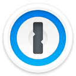

# Best Password Managers Curated by Github Users

Open Source and Always a Work in Progress (WIP)

## Abstract

<!-- annotation: Simply the facts. -->

This technical assessment provides an evidence-based analysis of password management services. In contrast to commercial review sites, this framework prioritizes empirical analysis via independent security audits, public source code availability, and cryptographic verifiability.

## Methodology

### Evaluation Criteria

Our evaluation considers:

1. **Code Transparency**: Public availability of source code
2. **Independent Verification**: Third party security audits
3. **Architectural Verifiability**: Fact or trust
4. **Metadata Protection**: Technical implementation
5. **Encryption Design**: Client-side cryptography

<!-- callout: Ignore the marketing. Read the facts. -->

## Password Manager Comparison

| Rank | Service | Open Source | Independent Audit | Client-Side E2EE | Self-Host | Local-Only | Metadata Protected | Argon2 Support |
|------|---------|-------------|-------------------|------------------|-----------|------------|--------------------|----------------|
| 1 |  [KeePassXC](https://keepassxc.org/) | [✓ Yes](https://github.com/keepassxreboot/keepassxc) | ✓ Yes (code reviews) | ✓ Yes | ✓ Yes (file-based) | ✓ Yes | ✓ Yes (local file) | ✓ Yes |
| 2 |  [KeePass](https://keepass.info/) | [✓ Yes](https://sourceforge.net/projects/keepass/) | ✓ Yes (design review) | ✓ Yes | ✓ Yes | ✓ Yes | ✓ Yes | ✓ Yes |
| 3 |  [Bitwarden](https://bitwarden.com/) | [✓ Yes](https://github.com/bitwarden) | [✓ Yes](https://bitwarden.com/help/is-bitwarden-audited/) | ✓ Yes | ✓ Yes | ✗ No (cloud-focused) | ✗ No (partial) | ✓ Yes |
| 4 |  [1Password](https://1password.com/) | ✗ No (closed client) | [✓ Yes](https://support.1password.com/security-assessments/) | ✓ Yes | ✗ No | ✗ No | ✓ Yes | ✓ Yes |
| 5 |  [Proton Pass](https://proton.me/pass) | [✓ Yes (clients)](https://github.com/ProtonMail) | [✓ Yes](https://proton.me/blog/pass-open-source-security-audit) | ✓ Yes | ✗ No | ✗ No | ✓ Yes | ✓ Yes |
| 6 |  [Pass](https://www.passwordstore.org/) | [✓ Yes](https://git.zx2c4.com/password-store/) | ✗ No | ✓ Yes | ✓ Yes | ✓ Yes | ✓ Yes | ✓ Yes |
| 7 |  [KeePassium](https://keepassium.com/) | [✓ Yes](https://github.com/keepassium/KeePassium) | ✗ No | ✓ Yes | ✓ Yes | ✓ Yes | ✓ Yes | ✓ Yes |
| 8 |  [Enpass](https://www.enpass.io/) | ✗ No | ✗ No (partial) | ✓ Yes | ✗ No | ✓ Yes | ✗ No (partial) | ✗ No (PBKDF2-based) |
| 9 |  [NordPass](https://nordpass.com/) | ✗ No | [✓ Yes](https://nordpass.com/blog/nordpass-security-audit-2020/) | ✓ Yes | ✗ No | ✗ No | ✗ No (details not fully documented) | ✓ Yes |
| 10 |  [Dashlane](https://www.dashlane.com/) | ✗ No | [✓ Yes](https://support.dashlane.com/hc/en-us/articles/360012686840-FAQ-about-security-at-Dashlane) | ✓ Yes | ✗ No | ✗ No | ✗ No (details not fully documented) | ✓ Yes |
| 11 |  [LastPass](https://www.lastpass.com/) | ✗ No | ✗ No (partial) | ✗ No (partial) | ✗ No | ✗ No | ✗ No | ✓ Yes |

## Critical Understanding: Local Vaults vs. Cloud Vaults

### Class 1: Architectural Privacy (Local Vault, No Cloud)

The following password managers represent maximum privacy by design. They **cannot leak metadata by design**.

- **KeePassXC**: File-based architecture with no cloud component. Metadata leakage is architecturally impossible without user-chosen sync mechanism.
- **KeePass**: Original reference implementation. Zero server dependency; complete user control over data location and sync.
- **Pass**: GPG-based encrypted text files. Minimal attack surface; no cloud infrastructure; optionally self-managed git sync.

### Class 2: Cloud + Audit-Based Privacy

These password managers **encrypt client-side**, verified through audits and open-source code.

- **Bitwarden**: Verified by independent audits. Open-source client and server. Can be self-hosted for complete control.
- **1Password**: Verified by audits. Strong Secret Key design adds entropy beyond master password. Closed-source client limits verifiability.
- **Proton Pass**: Verified by audits. End-to-end encrypted within Proton ecosystem (including vault metadata). Clients are open source; server-side components remain proprietary.
- **Enpass**: Local-first design with optional cloud sync. Proprietary codebase limits verification.

### Class 3: Closed Cloud with Limited Transparency

- **NordPass**: Proprietary cloud-first model with limited audit transparency.
- **Dashlane**: Cloud-dependent architecture with significant metadata exposure and limited transparency.
- **LastPass**: A major multi-stage breach in 2022–2023 exposed encrypted vault backups and unencrypted metadata, with ongoing real-world account theft reported into 2024. Demonstrated architectural weaknesses and poor incident response. Not recommended.

## Detailed Service Analysis

### 1. KeePassXC

* **Code transparency:** [Fully published](https://github.com/keepassxreboot/keepassxc)
* **Verification:** Numerous community and academic code reviews
* **Org transparency:** [Fully disclosed](https://keepassxc.org/team/)
* **Privacy architecture:** File-based; AES-256; Argon2 KDF; no cloud component
* **Signup & payment:** Free; no account required
* **What's logged (by policy):** Nothing (local-only)
* **Demonstrated metadata exposure:** None
* **Operational history:** ~9 years (fork of KeePassX)

---

### 2. KeePass (KDBX)

* **Code transparency:** [Fully published](https://sourceforge.net/projects/keepass/)
* **Verification:** Widely reviewed open design and implementation
* **Org transparency:** [Fully disclosed](https://keepass.info/help/base/credits.html)
* **Privacy architecture:** File-based; AES-256; Argon2 KDF; KDBX format standard
* **Signup & payment:** Free; no account required
* **What's logged (by policy):** Nothing (local-only)
* **Demonstrated metadata exposure:** None
* **Operational history:** ~20 years

---

### 3. Bitwarden

* **Code transparency:** [Fully published](https://github.com/bitwarden)
* **Verification:** [Multiple security audits](https://bitwarden.com/help/security-reports/)
* **Org transparency:** [Fully disclosed](https://bitwarden.com/about/)
* **Privacy architecture:** Client-side E2EE; PBKDF2/Argon2; self-hostable server
* **Signup & payment:** Email required; free tier available; paid plans for premium features
* **What's logged (by policy):** Item count, timestamps (encrypted vault only)
* **Demonstrated metadata exposure:** Some metadata visible to server (item count, sync times)
* **Operational history:** ~9 years

---

### 4. 1Password

* **Code transparency:** Proprietary (closed-source client)
* **Verification:** [External security assessments](https://1passwordstatic.com/files/security/1password-security-assessment.pdf)
* **Org transparency:** [Fully disclosed](https://1password.com/company/)
* **Privacy architecture:** SRP + Secret Key design; AES-256; dual-key derivation
* **Signup & payment:** Email required; paid subscription
* **What's logged (by policy):** Account & telemetry data; vault item metadata (titles, URLs, tags) remain encrypted
* **Demonstrated metadata exposure:** Limited metadata visible to service
* **Operational history:** ~18 years

---

### 5. Proton Pass

* **Code transparency:** [Partially published](https://github.com/ProtonMail)
* **Verification:** [Cure53 security audit](https://proton.me/blog/proton-pass-security-audit)
* **Org transparency:** [Fully disclosed](https://proton.me/about/team)
* **Privacy architecture:** Client-side E2EE; Argon2 + bcrypt key derivation; Proton infrastructure with encrypted vault metadata
* **Signup & payment:** Email required; free tier available
* **What's logged (by policy):** Account and billing data, alias addresses needed for forwarding; vault contents and most metadata are end-to-end encrypted
* **Demonstrated metadata exposure:** None reported; aliases necessarily remain unencrypted for mail routing
* **Operational history:** Launched 2023 (~2–3 years)

---

### 6. Pass (Unix Password Store)

* **Code transparency:** [Fully published](https://git.zx2c4.com/password-store/)
* **Verification:** Open design; GPG-based
* **Org transparency:** [Fully disclosed](https://www.passwordstore.org/)
* **Privacy architecture:** GPG encryption; text-file based; optional git sync
* **Signup & payment:** Free; no account required
* **What's logged (by policy):** Nothing (local-only unless self-synced)
* **Demonstrated metadata exposure:** None (unless user configures cloud sync)
* **Operational history:** ~13 years

---

### 7. KeePassium (iOS KeePass Client)

* **Code transparency:** [Fully published](https://github.com/keepassium/KeePassium)
* **Verification:** Community reviewed
* **Org transparency:** [Fully disclosed](https://keepassium.com/articles/who-created-keepassium/)
* **Privacy architecture:** Inherits KeePass KDBX format; local or self-synced files
* **Signup & payment:** Free tier; optional paid features
* **What's logged (by policy):** Nothing (local-only)
* **Demonstrated metadata exposure:** None
* **Operational history:** ~6 years

---

### 8. Enpass

* **Code transparency:** Proprietary
* **Verification:** Limited audit information
* **Org transparency:** [Partially disclosed](https://www.enpass.io/about/)
* **Privacy architecture:** Local-first with optional cloud sync; AES-256
* **Signup & payment:** Optional account for sync; one-time purchase or subscription
* **What's logged (by policy):** Sync metadata if cloud enabled
* **Demonstrated metadata exposure:** Metadata visible if cloud sync used
* **Operational history:** ~12 years

---

### 9. NordPass

* **Code transparency:** Proprietary
* **Verification:** Limited audit transparency
* **Org transparency:** Not fully disclosed. Owned by [Nord Security](https://nordsecurity.com/)
* **Privacy architecture:** XChaCha20; cloud-dependent
* **Signup & payment:** Email required; paid subscription
* **What's logged (by policy):** Account, device, and sync information; vault contents stored encrypted
* **Demonstrated metadata exposure:** No public breaches of encrypted vaults; standard cloud-service metadata exposure (accounts, devices, sync events)
* **Operational history:** ~6 years

---

### 10. Dashlane

* **Code transparency:** Proprietary
* **Verification:** Limited audit information
* **Org transparency:** [Partially disclosed](https://www.dashlane.com/about)
* **Privacy architecture:** AES-256; cloud-dependent
* **Signup & payment:** Email required; paid subscription
* **What's logged (by policy):** Account, billing, device and usage telemetry; vault contents stored as encrypted blobs
* **Demonstrated metadata exposure:** No public breaches of encrypted vaults; standard cloud-service metadata exposure (accounts, devices, billing)
* **Operational history:** ~13 years

---

### 11. LastPass

* **Code transparency:** Proprietary
* **Verification:** Limited audit information
* **Org transparency:** Not fully disclosed. Owned by [LogMeIn/GoTo](https://www.goto.com/)
* **Privacy architecture:** AES-256; cloud-dependent; compromised design (PBKDF2 with added Argon2 key derivation since 2023)
* **Signup & payment:** Email required; free tier with limitations
* **What's logged (by policy):** Full vault metadata
* **Demonstrated metadata exposure:** [Multiple breaches 2022-2024](https://blog.lastpass.com/2022/12/notice-of-recent-security-incident/) exposed metadata and encrypted vaults
* **Operational history:** ~18 years

## Conclusion

KeePassXC and KeePass represent the gold standard for password management through architectural privacy. Their file-based, local-first design makes metadata leakage impossible without user action, and their fully open-source codebases enable complete verification.

Bitwarden stands out as the best cloud-based option, combining open-source transparency with independent audits and self-hosting capability. For users requiring cloud sync convenience, Bitwarden provides the best balance of usability and verifiable security.

1Password offers strong cryptography through its Secret Key design but remains limited by its proprietary codebase. Users must trust rather than verify its implementation.

LastPass should be avoided entirely due to its demonstrated security failures and poor incident response history. The 2022-2024 breach sequence exposed fundamental architectural weaknesses and inadequate security practices.

The ideal password management strategy prioritizes local-first architecture (KeePassXC/KeePass) when possible, or open-source cloud solutions (Bitwarden) when sync convenience is essential. Proprietary cloud solutions require trusting unverifiable claims about security implementation.

<!-- navigation -->
[Abstract](#abstract) [Methodology](#methodology) [Comparison](#password-manager-comparison) [Categories](#critical-understanding-local-vaults-vs-cloud-vaults) [Details](#detailed-service-analysis) [Conclusion](#conclusion)

## Footer

A public service by the users of Github.
