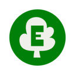
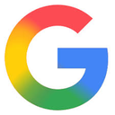

# Best Search Engines Curated by Github Users

Open Source and Always a Work in Progress (WIP)

## Abstract

<!-- annotation: Simply the facts. -->

This technical assessment provides an evidence-based analysis of search engine services. In contrast to commercial review sites, this framework prioritizes empirical analysis via privacy policies, open source availability, independent audits, and operational transparency.

## Methodology

<!-- annotation: Evidence-based evaluation. -->

### Evaluation Criteria

Our evaluation considers:

1. **Code Transparency**: Public availability of source code
2. **Privacy Policy**: Clear and verifiable no-tracking policies
3. **Data Collection**: What user data is collected and stored
4. **Independent Verification**: Third party audits and reviews
5. **Privacy Architecture**: Technical implementation and tracking prevention

<!-- callout: Ignore the marketing. Read the facts. -->

## Search Engine Comparison

| Rank | Service | Open Source | No Tracking | No Logs | Anonymous | Own Index | Audited |
|------|---------|-------------|-------------|---------|-----------|-----------|---------|
| 1 |  [Kagi](https://kagi.com/) | ✗ No | ✓ Yes | ✓ Yes | ✗ No | ✓ Yes | ✗ No |
| 2 |  [Brave Search](https://search.brave.com/) | ✗ No | ✓ Yes | ✓ Yes | ✓ Yes | ✓ Yes | ✗ No |
| 3 |  [SearXNG](https://searxng.org/) | [✓ Yes](https://github.com/searxng/searxng) | ✓ Yes | ✓ Yes | ✓ Yes | ✗ No | ✗ No |
| 4 |  [DuckDuckGo](https://duckduckgo.com/) | ✗ No | ✓ Yes | ✓ Yes | ✓ Yes | ✗ No | ✗ No |
| 5 |  [Startpage](https://www.startpage.com/) | ✗ No | ✓ Yes | ✓ Yes | ✓ Yes | ✗ No | [✓ Yes](https://www.startpage.com/en/privacy-please/privacy-reports/) |
| 6 |  [Mojeek](https://www.mojeek.com/) | ✗ No | ✓ Yes | ✓ Yes | ✓ Yes | ✓ Yes | ✗ No |
| 7 |  [Qwant](https://www.qwant.com/) | ✗ No | ✓ Yes | ✓ Yes | ✓ Yes | ✓ Yes | ✗ No |
| 8 |  [Ecosia](https://www.ecosia.org/) | ✗ No | ✓ Yes | ✗ No | ✓ Yes | ✗ No | ✗ No |
| 9 |  [Bing](https://www.bing.com/) | ✗ No | ✗ No | ✗ No | ✗ No | ✓ Yes | ✗ No |
| 10 |  [Google](https://www.google.com/) | ✗ No | ✗ No | ✗ No | ✗ No | ✓ Yes | ✗ No |

## Critical Understanding: Privacy vs Tracking Based Search

### Class 1: Privacy First (No Tracking by Design)

The following search engines represent privacy-focused alternatives. They **do not track by design**.

- **Kagi**: Paid subscription model eliminates advertising incentives. No tracking of searches or clicks; no profiling; minimal data collection needed to operate the service. Paid model ensures alignment with user privacy.
- **Brave Search**: Independent index built from scratch. No user profiling, no tracking, anonymous usage possible. Built by privacy-focused Brave Software.

### Class 2: Privacy Respecting (Verified by Policy)

These search engines **do not track by policy**, verified through privacy policies and operational transparency.

- **SearXNG**: Open source metasearch engine. Self-hostable. No tracking by design. Queries multiple search engines without passing user data.
- **DuckDuckGo**: Verified privacy policy. Does not log searches or use tracking cookies. Metasearch engine using Bing and other sources.
- **Startpage**: Privacy audited. Anonymous proxy view. Uses Google results without tracking. Based in Netherlands (EU privacy laws).
- **Mojeek**: Independent crawler and index. No user tracking. UK-based. Transparent privacy policy.
- **Qwant**: French search engine. GDPR compliant. No tracking or personalization. Based in France (EU privacy laws).
- **Ecosia**: Tree-planting search engine. Privacy respecting. Uses Bing results. Transparent operations.

## Detailed Service Analysis

### 1. Kagi

* **Code transparency:** Proprietary
* **Privacy policy:** [No ads, no tracking of search behavior, minimal data collection](https://kagi.com/privacy)
* **Org transparency:** [Fully disclosed](https://kagi.com/about)
* **Privacy architecture:** Paid subscription model; no advertising incentives; no user profiling
* **Own index:** Partial (operates Teclis for non-commercial web and TinyGem for news; supplements with external indexes)
* **What's logged (by policy):** Account email and billing-related information; no search logs tied to accounts (per policy)
* **Anonymous usage:** Account required; Privacy Pass available for paid users (cryptographic tokens allow searches not linkable to account)
* **Operational history:** ~3 years

---

### 2. Brave Search

* **Code transparency:** Proprietary (company open sources browser)
* **Privacy policy:** [No personal information collected about you, your device, or your searches](https://search.brave.com/help/privacy-policy)
* **Org transparency:** [Fully disclosed](https://brave.com/about/)
* **Privacy architecture:** Independent index; no user profiling; anonymous usage (aggregated anonymous metrics only)
* **Own index:** Yes (Brave Index)
* **What's logged (by policy):** Aggregated anonymous metrics only; no personal data
* **Anonymous usage:** Yes
* **Operational history:** ~4 years

---

### 3. SearXNG

* **Code transparency:** [Fully open source](https://github.com/searxng/searxng)
* **Privacy policy:** [No tracking by design](https://docs.searxng.org/own-instance.html#privacy)
* **Org transparency:** [Community driven](https://docs.searxng.org/)
* **Privacy architecture:** Self-hostable metasearch; queries multiple engines without passing user data; no tracking by design
* **Own index:** No (metasearch engine)
* **What's logged (by policy):** No tracking by design; logging varies by instance operator
* **Anonymous usage:** Yes
* **Operational history:** ~3 years (fork of Searx ~8 years)

---

### 4. DuckDuckGo

* **Code transparency:** [Partially published](https://github.com/duckduckgo) (apps and browser extensions)
* **Privacy policy:** [No tracking, no search history saved or shared](https://duckduckgo.com/privacy)
* **Org transparency:** [Partially disclosed](https://duckduckgo.com/about)
* **Privacy architecture:** No unique tracking cookies; only anonymous cookies/local storage for settings; no personal identifiers
* **Own index:** Partial (uses Bing and 400+ other sources)
* **What's logged (by policy):** No personal identifiers; anonymous settings only
* **Anonymous usage:** Yes
* **Operational history:** ~17 years

---

### 5. Startpage

* **Code transparency:** Proprietary
* **Privacy policy:** [No tracking; previously audited with the EuroPriSe privacy seal](https://www.startpage.com/en/privacy-policy/)
* **Org transparency:** Not fully disclosed. Owned by [System1](https://system1.com/)
* **Privacy architecture:** Anonymous proxy view; removes identifying information before forwarding to Google
* **Own index:** No (uses Google results)
* **What's logged (by policy):** [Nothing identifiable](https://www.startpage.com/en/privacy-please/privacy-reports/)
* **Anonymous usage:** Yes
* **Operational history:** ~25 years

---

### 6. Mojeek

* **Code transparency:** Proprietary
* **Privacy policy:** [No tracking, no profiling](https://www.mojeek.com/about/privacy/)
* **Org transparency:** [Fully disclosed](https://www.mojeek.com/about/)
* **Privacy architecture:** Independent crawler; no user data collection; UK-based
* **Own index:** Yes (independent crawler)
* **What's logged (by policy):** [Very limited logs; see policy](https://www.mojeek.com/about/privacy/)
* **Anonymous usage:** Yes
* **Operational history:** ~20 years

---

### 7. Qwant

* **Code transparency:** Proprietary
* **Privacy policy:** [GDPR compliant, no tracking](https://about.qwant.com/legal/privacy/)
* **Org transparency:** [Fully disclosed](https://en.wikipedia.org/wiki/Qwant)
* **Privacy architecture:** French company; EU privacy laws; no personalization
* **Own index:** Partial (own crawler supplemented with Bing; joint EU index effort with Ecosia)
* **What's logged (by policy):** Nothing identifiable
* **Anonymous usage:** Yes
* **Operational history:** ~11 years

---

### 8. Ecosia

* **Code transparency:** Proprietary (publishes financial reports)
* **Privacy policy:** [Privacy respecting, no tracking](https://info.ecosia.org/privacy)
* **Org transparency:** [Fully disclosed with transparency reports](https://blog.ecosia.org/ecosia-financial-reports-tree-planting-receipts/)
* **Privacy architecture:** Uses Bing; anonymizes searches; tree-planting mission
* **Own index:** No (uses Bing results)
* **What's logged (by policy):** [IP anonymized after 7 days; partners (Microsoft/Google) retain longer per their policies](https://info.ecosia.org/privacy)
* **Anonymous usage:** Yes
* **Operational history:** ~16 years

---

### 9. Bing

* **Code transparency:** Proprietary
* **Privacy policy:** [Tracks users extensively](https://privacy.microsoft.com/en-us/privacystatement)
* **Org transparency:** [Fully disclosed](https://www.microsoft.com/)
* **Privacy architecture:** Tracks searches, builds user profiles, targets ads
* **Own index:** Yes (Microsoft's own crawler)
* **What's logged (by policy):** [Extensive user data](https://privacy.microsoft.com/en-us/privacystatement)
* **Anonymous usage:** No
* **Operational history:** ~16 years

---

### 10. Google

* **Code transparency:** Proprietary
* **Privacy policy:** [Tracks users extensively](https://policies.google.com/privacy)
* **Org transparency:** [Fully disclosed](https://about.google/)
* **Privacy architecture:** Tracks searches, builds detailed user profiles, targets ads across services
* **Own index:** Yes (world's largest search index)
* **What's logged (by policy):** [Extensive user data across all Google services](https://policies.google.com/privacy)
* **Anonymous usage:** No
* **Operational history:** ~27 years

## Conclusion

Kagi and Brave Search represent a new generation of privacy-first search engines with independent indexes. Kagi's paid model eliminates advertising conflicts of interest, while Brave's anonymous-by-default approach provides similar benefits without payment requirements.

For users prioritizing open source and self-hosting, SearXNG provides complete transparency and control. DuckDuckGo remains the most popular privacy alternative with 17+ years of operation, while Startpage offers Google results without tracking for users who prefer Google's search quality.

The traditional search giants (Google and Bing) offer superior search quality through extensive data collection but at significant privacy costs. The choice between search quality and privacy continues to narrow as privacy-focused alternatives improve their indexes and algorithms.

<!-- navigation -->
[Abstract](#abstract) [Methodology](#methodology) [Comparison](#search-engine-comparison) [Categories](#critical-understanding-privacy-vs-tracking-based-search) [Details](#detailed-service-analysis) [Conclusion](#conclusion)

## Footer

A public service by the users of Github.
