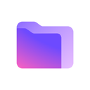
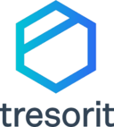
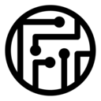
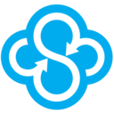
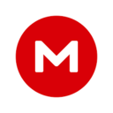
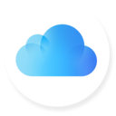
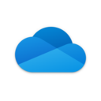
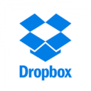

# Best Secure Storage & Backup Services Curated by GitHub Users

Open Source and Always a Work in Progress (WIP)

## Abstract

<!-- annotation: Simply the facts. -->

This technical assessment provides an evidence-based analysis of cloud storage and backup services. This framework prioritizes empirical analysis via independent security audits, public source code availability, end-to-end encryption implementation, and metadata protection capabilities.

## Methodology

### Evaluation Criteria

Our evaluation considers:

1. **Code Transparency**: Public availability of source code
2. **Independent Verification**: Third party security audits
3. **End-to-End Encryption (E2EE)**: Client-side encryption before upload
4. **Metadata Protection**: Protection of filenames, folder structure, and file metadata
5. **Zero-Knowledge Architecture**: Provider unable to decrypt user files
6. **Self-Hosting Capability**: Can users run their own backend
7. **Local-Only Mode**: Can function without cloud dependency

<!-- callout: Ignore the marketing. Read the facts. -->

## Cloud Storage / Backup Service Comparison

| Rank | Service | Source Available | Proof | Default E2EE | Metadata Protected | Self-Host | Local-Only |
|------|---------|------------------|-------|--------------|-------------------|-----------|------------|
| 1 |  [Cryptomator](https://cryptomator.org/) | ✓ Yes | ✓ Yes | ✓ Yes | ✓ Yes | ✓ Yes | ✓ Yes |
| 2 |  [Proton Drive](https://proton.me/drive) | ✓ Yes | ✓ Yes | ✓ Yes | ✓ Yes (partial) | ✗ No | ✗ No |
| 3 |  [Tresorit](https://tresorit.com/) | ✗ No | ✓ Yes | ✓ Yes | ✓ Yes (partial) | ✗ No | ✗ No |
| 4 |  [Filen.io](https://filen.io/) | ✓ Yes (clients) | ✓ Yes (partial) | ✓ Yes | ✓ Yes (partial) | ✗ No | ✗ No |
| 5 |  [Sync.com](https://www.sync.com/) | ✗ No | ✗ No | ✓ Yes | ✓ Yes (partial) | ✗ No | ✗ No |
| 6 |  [MEGA](https://mega.io/) | ✓ Yes (clients) | ✓ Yes (partial) | ✓ Yes | ✓ Yes (partial) | ✗ No | ✗ No |
| 7 |  [Nextcloud](https://nextcloud.com/) | ✓ Yes | ✓ Yes | ✗ No (optional) | ✗ No | ✓ Yes | ✓ Yes |
| 8 |  [Seafile](https://www.seafile.com/) | ✓ Yes (partial) | ✗ No | ✓ Yes (optional) | ✗ No | ✓ Yes | ✓ Yes |
| 9 |  [iCloud Drive](https://www.icloud.com/) | ✗ No | ✗ No | ✗ No (ADP optional) | ✗ No | ✗ No | ✗ No |
| 10 |  [OneDrive](https://www.microsoft.com/en-us/microsoft-365/onedrive/) | ✗ No | ✗ No | ✗ No | ✗ No | ✗ No | ✗ No |
| 11 |  [Google Drive](https://drive.google.com/) | ✗ No | ✗ No | ✗ No | ✗ No | ✗ No | ✗ No |
| 12 |  [Dropbox](https://www.dropbox.com/) | ✗ No | ✗ No | ✗ No | ✗ No | ✗ No | ✗ No |
## Critical Understanding: Local Encryption vs Cloud Encryption

### Class 1: Local Encryption (Best Protection)

The following storage solutions represent the highest level of privacy protection. They **cannot access your data by design**.

- **Cryptomator**: Client-side encrypted vault system. Cloud provider only sees encrypted blobs. Filenames, folder structure, and content fully protected. Cryptographically impossible for any cloud provider to access data.

### Class 2: Cloud E2EE (Good Protection with Some Metadata Exposure)

These services implement **end-to-end encryption by design**, but still expose some metadata to the provider and may have protocol limitations under a malicious‑server model.

- **Proton Drive**: End-to-end encrypted by design. File contents and most file metadata (including filenames) are encrypted; some metadata (for example file sizes and timestamps) and account-level connection data remain visible. Strong Swiss jurisdiction.
- **Tresorit**: Enterprise-grade client-side encryption with multiple independent audits and recent academic scrutiny; still exposes some metadata needed for quota and access control, and earlier research highlighted integrity weaknesses that Tresorit has since worked to address.
- **Filen.io**: Zero-knowledge E2EE implementation with open-source clients and a growing security community around it. Some metadata may still be visible to the service.
- **Sync.com**: Zero-knowledge encryption for file contents and filenames. Some metadata (file sizes, timestamps, and certain sharing metadata) is unencrypted, and recent academic work shows that a malicious server can tamper with this metadata and the binding between filenames and content.
- **MEGA**: End-to-end encryption for file contents and directory structure, with filenames stored encrypted on the server. Some metadata (file sizes and access patterns) remains visible, and several cryptographic analyses have raised concerns about aspects of MEGA’s protocol design.

### Class 3: Self-Hosted Solutions (Security = Your Server Configuration)

Security and privacy depend entirely on your server setup and configuration.

- **Nextcloud**: Fully open source self-hosted cloud. E2EE available as optional add-on. Default configuration uses server-side encryption only.
- **Seafile**: Lightweight self-hosted sync platform. Optional library-level E2EE with weaker implementation than modern alternatives.

### Class 4: Cloud-Side Encryption (No Zero-Knowledge by Default)

These services control encryption keys for typical usage and can technically access both content and metadata, although some now offer opt‑in or limited forms of client‑side encryption for specific plans or file types.

- **iCloud Drive**: Some categories (like Keychain and Health data) are always end‑to‑end encrypted. Most file types, including iCloud Drive documents, use server‑side encryption by default, but enabling Advanced Data Protection extends end‑to‑end encryption to iCloud Drive files and many more categories. Metadata remains visible to Apple.
- **OneDrive**: Uses server‑side encryption with keys held by Microsoft. Personal Vault adds extra authentication and local protections for a subset of files but is not truly end‑to‑end encrypted; Microsoft can still scan and access Vault contents if required.
- **Google Drive**: Uses server‑side encryption and active content scanning by default, with Google controlling the keys. Some Google Workspace editions support optional client‑side encryption for selected files, in which case Google cannot decrypt those particular items.
- **Dropbox**: Historically relied on server‑side encryption only, with Dropbox able to access file content and metadata. In 2025 Dropbox introduced optional end‑to‑end encrypted team folders for some business customers, but most accounts still operate in a model where Dropbox controls the keys.

## Detailed Service Analysis

### 1. Cryptomator

* **Code transparency:** [Fully published](https://github.com/cryptomator)
* **Verification:** [Independent security audits](https://community.cryptomator.org/t/has-there-been-a-security-review-audit-of-cryptomator/44)
* **Org transparency:** [Fully disclosed](https://community.cryptomator.org/u/tobihagemann/summary)
* **Privacy architecture:** Client-side vault encryption; per-file encryption; filename and folder structure encrypted; compatible with any cloud provider
* **Signup & payment:** No account required (uses your existing cloud storage)
* **What's logged (by policy):** None (no cloud service)
* **Demonstrated metadata exposure:** None
* **Operational history:** ~10 years

---

### 2. Proton Drive

* **Code transparency:** All Proton Drive apps (web, desktop, and mobile) are now open source
* **Verification:** Independently audited, including security reviews of Proton Drive apps (for example by Securitum)
* **Org transparency:** [Fully disclosed](https://proton.me/about/team)
* **Privacy architecture:** End-to-end encryption by design; zero-knowledge architecture for file content; most file metadata (including filenames) is encrypted, though some metadata like file sizes and timestamps remains visible to the service
* **Signup & payment:** Email required; accepts Bitcoin, card, etc.
* **What's logged (by policy):** Connection metadata and some usage metadata (for abuse prevention and accounting)
* **Demonstrated metadata exposure:** File sizes and some usage metadata visible to provider
* **Operational history:** ~5 years

---

### 3. Tresorit

* **Code transparency:** Proprietary
* **Verification:** [Multiple security audits](https://tresorit.com/blog/ernst-young-review-verifies-tresorits-security-architecture/)
* **Org transparency:** [Fully disclosed](https://tresorit.com/about-us)
* **Privacy architecture:** Client-side encryption; enterprise-grade security; consistently audited implementation
* **Signup & payment:** Email required; card payment
* **What's logged (by policy):** Temporary connection data, some metadata
* **Demonstrated metadata exposure:** Some metadata visible to provider
* **Operational history:** ~12 years

---

### 4. Filen.io

* **Code transparency:** Client apps are open source (AGPLv3); server-side components remain proprietary
* **Verification:** Partial security documentation; no widely publicized third‑party cryptographic audit yet
* **Org transparency:** [Disclosed](https://filen.io/about)
* **Privacy architecture:** Zero-knowledge end-to-end encryption; client-side encryption before upload
* **Signup & payment:** Email required; accepts crypto and card
* **What's logged (by policy):** Minimal connection logs
* **Demonstrated metadata exposure:** Some metadata (for example, file sizes or basic usage data) may be visible
* **Operational history:** ~3 years

---

### 5. Sync.com

* **Code transparency:** Proprietary
* **Verification:** No published independent cryptographic audits (general security & compliance documentation exists)
* **Org transparency:** Not fully disclosed
* **Privacy architecture:** Zero‑knowledge encryption for file contents and filenames; some metadata such as file size, timestamps, and certain sharing metadata is stored on and can be modified by the server
* **Signup & payment:** Email required; card payment
* **What's logged (by policy):** Connection logs and some metadata (for example file sizes and timestamps), but filenames and folder names are stored encrypted
* **Demonstrated metadata exposure:** Research has shown that unencrypted metadata can be tampered with by a malicious server, and that filename–content bindings can be manipulated
* **Operational history:** ~12 years

---

### 6. MEGA

* **Code transparency:** Backend proprietary; client and SDK source are published but not fully FLOSS
* **Verification:** Historical cryptographic analyses and third‑party research; several papers and blog posts have raised concerns about aspects of the JavaScript crypto implementation
* **Org transparency:** Not fully disclosed
* **Privacy architecture:** End‑to‑end encryption for file content as well as filenames and directory structure (stored encrypted on MEGA’s servers); some metadata such as file sizes and access patterns remains visible to the service
* **Signup & payment:** Email required; accepts crypto and card
* **What's logged (by policy):** File sizes, access patterns, and account metadata; filenames and folder structure are stored only in encrypted form
* **Demonstrated metadata exposure:** Metadata such as file sizes and usage patterns is visible; earlier research has focused more on cryptographic design issues than on plaintext filename leakage
* **Operational history:** ~12 years

---

### 7. Nextcloud (Self-Hosted)

* **Code transparency:** [Fully published](https://github.com/nextcloud)
* **Verification:** [Security audits](https://nextcloud.com/blog/nextcloud-security/)
* **Org transparency:** [Fully disclosed](https://nextcloud.com/about/)
* **Privacy architecture:** Server-side encryption by default; optional E2EE module available; privacy depends on server configuration
* **Signup & payment:** Self-hosted (you control)
* **What's logged (by policy):** Depends on server configuration
* **Demonstrated metadata exposure:** Visible to server operator by default
* **Operational history:** ~11 years

---

### 8. Seafile

* **Code transparency:** Partially published (community edition open source; some components proprietary)
* **Verification:** No comprehensive independent audits; recent academic work and community reviews have highlighted design weaknesses
* **Org transparency:** [Disclosed](https://www.seafile.com/en/about/)
* **Privacy architecture:** Optional library‑level end‑to‑end encryption for file contents, but file metadata (including filenames, directory tree, and sizes) remains unencrypted on the server; primarily a server‑side security model
* **Signup & payment:** Self-hosted (you control)
* **What's logged (by policy):** Depends on server configuration
* **Demonstrated metadata exposure:** File metadata (filenames, folder structure, sizes) visible to the server operator even for encrypted libraries
* **Operational history:** ~13 years

---

### 9. iCloud Drive

* **Code transparency:** Proprietary
* **Verification:** Internal and third‑party compliance audits; no public cryptographic E2EE audit of iCloud Drive
* **Org transparency:** Not fully disclosed
* **Privacy architecture:** By default, most iCloud Drive files are encrypted in transit and at rest with keys controlled by Apple; a subset of iCloud data (for example Keychain, Health) is always end‑to‑end encrypted, and enabling Advanced Data Protection extends end‑to‑end encryption to iCloud Drive files and many more categories
* **Signup & payment:** Apple ID required; card payment
* **What's logged (by policy):** Full metadata, including filenames, folder structure, and access patterns, plus other account and device metadata
* **Demonstrated metadata exposure:** Full visibility to Apple for most data types and metadata, even when Advanced Data Protection is enabled
* **Operational history:** ~14 years

---

### 10. OneDrive

* **Code transparency:** Proprietary
* **Verification:** Compliance audits (SOC2/ISO) but not focused on end‑to‑end encryption guarantees
* **Org transparency:** Not fully disclosed
* **Privacy architecture:** Server‑side encryption only; Personal Vault adds extra authentication and local protections for a subset of files but is not end‑to‑end encrypted, and Microsoft retains control of the encryption keys
* **Signup & payment:** Microsoft account required; card payment
* **What's logged (by policy):** Full access to file contents and metadata is technically possible for Microsoft
* **Demonstrated metadata exposure:** Complete visibility to Microsoft
* **Operational history:** ~14 years

---

### 11. Google Drive

* **Code transparency:** Proprietary
* **Verification:** Compliance and security audits; optional client‑side encryption features for some Google Workspace editions have been independently evaluated but are not enabled by default
* **Org transparency:** Not fully disclosed
* **Privacy architecture:** By default, Google Drive uses server‑side encryption with keys controlled by Google and performs automated content scanning; paid Workspace customers can optionally enable client‑side encryption for certain file types, in which case Google cannot decrypt those specific files
* **Signup & payment:** Google account required; card payment
* **What's logged (by policy):** Full access to content and metadata for non‑client‑side‑encrypted files; extensive logging and scanning for abuse and policy violations
* **Demonstrated metadata exposure:** Complete visibility into content and metadata for standard (non‑CSE) usage
* **Operational history:** ~18 years

---

### 12. Dropbox

* **Code transparency:** Proprietary
* **Verification:** Compliance audits (SOC2/ISO) but historically no public end‑to‑end cryptographic audit of new E2EE features
* **Org transparency:** Not fully disclosed
* **Privacy architecture:** Traditionally relied on server‑side encryption with Dropbox holding the keys and having technical access to file contents and metadata; in 2025 Dropbox introduced optional end‑to‑end encrypted team folders for some business plans, but most usage still relies on server‑side encryption
* **Signup & payment:** Email required; card payment
* **What's logged (by policy):** Broad logging of access, device, and sharing metadata; historically Dropbox has been able to scan and deduplicate file contents
* **Demonstrated metadata exposure:** Complete visibility into content and metadata for non‑E2EE folders
* **Operational history:** ~18 years

## Conclusion

Cryptomator represents the gold standard for storage privacy by eliminating trust requirements entirely. Its client-side vault encryption ensures zero visibility for any cloud provider. For users requiring cloud-native solutions, Proton Drive offers the best balance of E2EE protection and usability, though with some metadata exposure. Self-hosted solutions like Nextcloud provide control but require technical expertise and proper E2EE configuration.

Services like Google Drive, Dropbox, and OneDrive should be considered convenience tools rather than privacy solutions, as they maintain full visibility into both content and metadata.

<!-- navigation -->
[Abstract](#abstract) [Methodology](#methodology) [Comparison](#cloud-storage--backup-service-comparison) [Categories](#critical-understanding-local-encryption-vs-cloud-encryption) [Details](#detailed-service-analysis) [Conclusion](#conclusion)

## Footer

A public service by the users of GitHub.
