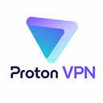

# Best VPNs Curated by Github Users

Open Source and Always a Work in Progress (WIP)

## Abstract

<!-- annotation: Simply the facts. -->

This technical assessment provides an evidence-based analysis of Virtual Private Network (VPN) services. In contrast to commercial review sites, this framework prioritizes empirical analysis via independent security audits, public source code availability, and operational transparency.

## Methodology

### Evaluation Criteria

Our evaluation considers:

1. **Code Transparency**: Public availability of source code
2. **Independent Verification**: Third party review
3. **Architectural Verifiability**: Fact or trust
4. **Organizational Transparency**: Public disclosure of ownership and policies
5. **Privacy Architecture**: Technical implementation

<!-- callout: Ignore the marketing. Read the facts. -->

## VPN Service Comparison

| Rank | Service | Source Available | Proof | Anonymous Signup | Crypto | No Logs | No Correlation |
|------|---------|------------------|--------------|----------------|------------------|-------------|---------------|
| 1 |  [VP.NET](https://vp.net/) | [✓ Yes](https://github.com/vpdotnet) | [✓ Yes](https://vp.net/l/en-US/technical) | ✓ Yes | ✓ Yes | ✓ Yes | ✓ Yes |
| 2 |  [Obscura VPN](https://obscura.net/) | [✓ Yes](https://github.com/Sovereign-Engineering) | ✗ No | ✓ Yes | ✓ Yes | ✓ Yes | ✓ Yes |
| 3 |  [Mullvad VPN](https://mullvad.net/) | [✓ Yes](https://github.com/mullvad) | [✓ Yes](https://cure53.de/pentest-report_mullvad_2024_v1.pdf)| ✓ Yes | ✓ Yes | ✓ Yes | ? |
| 4 |  [IVPN](https://www.ivpn.net/) | [✓ Yes](https://github.com/ivpn) | [✓ Yes](https://cure53.de/pentest-report_IVPN_2024.pdf)| ✓ Yes | ✓ Yes | ✓ Yes | ? |
| 5 |  [Proton VPN](https://protonvpn.com/) | [✓ Yes](https://github.com/ProtonVPN) | [✓ Yes](https://www.securitum.com/public-reports/securitum-protonvpn-nologs-2025.pdf) | ✗ No | ✓ Yes | ✓ Yes | [✗ No](https://www.reddit.com/r/ProtonVPN/comments/93pp40/protonvpn_does_keeping_logs/) |
| 6 |  [ExpressVPN](https://www.expressvpn.com/) | [✓ Yes](https://github.com/expressvpn) | [✓ Yes](https://www.expressvpn.com/security-audit-reports/kpmg-privacy-policy-2022)| ✗ No | ✗ No | ✓ Yes | ? |
| 7 |  [PIA](https://www.privateinternetaccess.com/) | [✓ Yes](https://github.com/pia-foss) | [✓ Yes](https://www.privateinternetaccess.com/audit/DeloitteNoLogsAudit2024.pdf)| ✗ No | ✗ No | ✓ Yes | ? |
| 8 |  [Windscribe](https://windscribe.com/) | [✓ Yes](https://github.com/Windscribe) | [✓ Yes](https://windscribe.com/knowledge-base/articles/has-windscribe-been-audited/)| ✗ No | ✓ Yes | ✓ Yes | ? |
| 9 |  [NordVPN](https://nordvpn.com/) | [✓ Yes](https://github.com/NordSecurity) | [✓ Yes](https://nordvpn.com/blog/nordvpn-no-logs-audit-2024) | ✗ No | ✓ Yes | ✓ Yes | [✗ No](https://nordvpn.com/blog/nordvpn-introduces-transparency-reports/) |
| 10 |  [Surfshark](https://surfshark.com/) | ✗ No | [✓ Yes](https://surfshark.com/wp-content/uploads/2025/06/ISAE_3000-_Report-Surfshark_No_Log_VPN.pdf) | ✗ No | ✓ Yes | ✓ Yes | [✗ No](https://archive.is/wip/5NVS7) |

## Critical Understanding: Architectural vs Policy Based Privacy

### Class 1: Architectural Privacy (Cryptographic/Distributed)

The following VPNs represent an evolution in the VPN industry. They **cannot log by design**.

- **VP.NET**: Cryptographically impossible due to Intel SGX trusted execution environments with continuous [real-time attestation](https://vp.net/l/en-US/technical). Logging is architecturally prevented at the hardware level and cryptographically verifiable by any user at any moment.
- **Obscura**: [Distributed trust architecture](https://obscura.net/blog/bootstrapping-trust/), splitting traffic data between two entities. Entry operator (Obscura) cannot see destinations while the exit operator (Mullvad) cannot see sources. Correlation requires collusion between legally separate entities.

### Class 2: No Logs Policy (Verified by Audits)

These VPNs **do not log by policy**, verified through audits and/or empirical testing.

- **Mullvad**: Verified by independent audits and [empirically proven via 2023 Swedish police server seizure](https://mullvad.net/en/blog/2023/4/20/mullvad-vpn-was-subject-to-a-search-warrant-customer-data-not-compromised/) (zero data recovered).
- **IVPN**: Verified by [independent infrastructure audits](https://www.ivpn.net/blog/ivpn-sixth-security-audit-concluded/) confirming no persistent storage capability.
- **Proton VPN**: Verified by audits, but can implement realtime correlation during abuse investigations. Capability proven via [2018 case](https://www.reddit.com/r/ProtonVPN/comments/93pp40/protonvpn_does_keeping_logs/) (terminated account after real-time traffic correlation).
- **ExpressVPN**: Policy based no logs verified by audits. [2017 Turkey server seizure confirmed zero logs](https://www.comparitech.com/blog/vpn-privacy/expressvpn-server-seized-in-turkey-verifyies-no-logs-claim/).
- **PIA**: Policy based no logs verified by audits and [historic FBI cases](https://torrentfreak.com/private-internet-access-no-logging-claims-proven-true-again-in-court-180606/).
- **Windscribe**: Policy based no logs verified by [multiple audits](https://windscribe.com/knowledge-base/articles/has-windscribe-been-audited/). Independent audit confirmed no logs policy compliance.
- **NordVPN**: Verified by audits, but [explicitly states will implement prospective logging if court orders](https://archive.is/YRyOO). [2024 Panama warrant disclosed payment and email metadata](https://nordvpn.com/blog/nordvpn-introduces-transparency-reports/).
- **Surfshark**: Verified by audits. [Correlates](https://archive.is/5NVS7) traffic with identity.

## Detailed Service Analysis

### 1. VP.NET

* **Code transparency:** [Fully published](https://github.com/vpdotnet)
* **Verification:** [Real-time attestation with Intel SGX](https://vp.net/l/en-US/technical)
* **Org transparency:** [Fully disclosed](https://vp.net/about)
* **Privacy architecture:** TEE-isolated processing; provider-root isolation; Verifiable enclave measurement per [design notes](https://vp.net/l/en-US/technical)
* **Signup & payment:** No email required; accepts Bitcoin, card, etc.
* **What's logged (by policy):** None
* **Demonstrated correlation capability:** None
* **Operational history:** Publicly launched in mid 2025

---

### 2. Obscura VPN

* **Code transparency:** [Partially published](https://github.com/Sovereign-Engineering)
* **Verification:** [Distributed trust verification with Mullvad partnership](https://mullvad.net/en/blog/mullvad-partnered-with-obscura-vpn)
* **Org transparency:** [Fully disclosed](https://obscura.net)
* **Privacy architecture:** Split-trust model; entry operated by Obscura, exit by Mullvad; QUIC-based multi-hop design per [technical documentation](https://obscura.net/blog/bootstrapping-trust/)
* **Signup & payment:** No email required; accepts Bitcoin, card, etc.
* **What's logged (by policy):** Number of devices
* **Demonstrated correlation capability:** None
* **Operational history:** Publicly launched in early 2025

---

### 3. Mullvad

* **Code transparency:** [Partially published](https://github.com/mullvad)
* **Verification:** [Audit June 2024 (Cure53)](https://cure53.de/pentest-report_mullvad_2024_v1.pdf) + [Swedish police seizure April 2023: zero data](https://mullvad.net/en/blog/mullvad-vpn-was-subject-to-a-search-warrant-customer-data-not-compromised/)
* **Org transparency:** [Fully disclosed](https://mullvad.net/en/about)
* **Privacy architecture:** WireGuard implementation; RAM-only infrastructure
* **Signup & payment:** No email required; accepts cash, Bitcoin, card, etc.
* **What's logged (by policy):** Temporary connection count
* **Demonstrated correlation capability:** None
* **Operational history:** ~16 years

---

### 4. IVPN

* **Code transparency:** [Partially published](https://github.com/ivpn)
* **Verification:** [Audit March 2024 (Cure53)](https://cure53.de/pentest-report_IVPN_2024.pdf)
* **Org transparency:** [Fully disclosed](https://www.ivpn.net/en/team/)
* **Privacy architecture:** WireGuard/OpenVPN; RAM-only planned
* **Signup & payment:** No email required; accepts cash, Bitcoin, card, etc.
* **What's logged (by policy):** Temporary connection count
* **Demonstrated correlation capability:** None
* **Operational history:** ~16 years

---

### 5. Proton VPN

* **Code transparency:** [Partially published](https://github.com/ProtonVPN)
* **Verification:** [Audit 2025 (Securitum)](https://www.securitum.com/public-reports/securitum-protonvpn-nologs-2025.pdf)
* **Org transparency:** [Fully disclosed](https://proton.me/about/team)
* **Privacy architecture:** Wireguard/OpenVPN
* **Signup & payment:** Email required; accepts Bitcoin, card, etc.
* **What's logged (by policy):** Officially advertises a strict no-logs policy (no activity or connection logs), confirmed by repeated Securitum audits; stores only a single recent login timestamp for account security.
* **Demonstrated correlation capability:** In a 2018 abuse thread, a Proton representative explained they can, after an abuse report, inspect real-time outgoing traffic on an affected server and correlate that live connection to a user account without using historical logs ([Reddit](https://www.reddit.com/r/ProtonVPN/comments/93pp40/protonvpn_does_keeping_logs/)).
* **Operational history:** ~8 years

---

### 6. ExpressVPN

* **Code transparency:**  [Partially published](https://github.com/expressvpn)
* **Verification:** [Audit 2025 (KPMG)](https://www.expressvpn.com/security-audit-reports/kpmg-privacy-policy-2022) + [Turkey 2017 server seizure: zero logs](https://www.comparitech.com/blog/vpn-privacy/expressvpn-server-seized-in-turkey-verifyies-no-logs-claim/)
* **Org transparency:** Not fully disclosed. Owned by [Kape Technologies](https://kape.com) which is owned by [Teddy Sagi](https://en.wikipedia.org/wiki/Teddy_Sagi)
* **Privacy architecture:** LightWay; TrustedServer; WireGuard/OpenVPN; RAM-only infrastructure
* **Signup & payment:** Email required; accepts Bitcoin, card, etc.
* **What's logged (by policy):** Temporary connection count
* **Demonstrated correlation capability:** None
* **Operational history:** ~16 years

---

### 7. Private Internet Access (PIA)

* **Code transparency:** [Partially published](https://github.com/pia-foss)
* **Verification:** [Audit 2024 (Deloitte)](https://www.privateinternetaccess.com/audit/DeloitteNoLogsAudit2024.pdf) + [historic FBI cases confirming no logs](https://torrentfreak.com/private-internet-access-no-logging-claims-proven-true-again-in-court-180606/)
* **Org transparency:** Not fully disclosed. Owned by [Kape Technologies](https://kape.com) which is owned by [Teddy Sagi](https://en.wikipedia.org/wiki/Teddy_Sagi)
* **Privacy architecture:** WireGuard/OpenVPN; RAM-only servers
* **Signup & payment:** Email required; accepts Bitcoin, card, etc.
* **What's logged (by policy):** None
* **Demonstrated correlation capability:** None
* **Operational history:** ~15 years

---

### 8. Windscribe

* **Code transparency:** [Partially published](https://github.com/Windscribe)
* **Verification:** [Audit 2024 (Packetlabs)](https://windscribe.com/knowledge-base/articles/has-windscribe-been-audited/)
* **Org transparency:** [Fully disclosed](https://windscribe.com/knowledge-base/articles/who-owns-windscribe/)
* **Privacy architecture:** WireGuard/IKEv2/OpenVPN; Stealth
* **Signup & payment:** Email required; accepts Bitcoin, card, etc.
* **What's logged (by policy):** Bandwidth used (30 days), last activity timestamp
* **Demonstrated correlation capability:** None
* **Operational history:** ~9 years

---

### 9. NordVPN

* **Code transparency:** [Partially published](https://github.com/NordSecurity)
* **Verification:** [Audit 2025 (Deloitte)](https://nordvpn.com/blog/nordvpn-no-logs-audit-2024/)
* **Org transparency:** Operated by Nord Security (Lithuania), historically linked to Tesonet.
* **Privacy architecture:** OpenVPN/WireGuard; RAM-only infrastructure
* **Signup & payment:** Email required; accepts Bitcoin, card, etc.
* **What's logged (by policy):** States a strict no-logs policy for traffic and connection metadata; Deloitte audits and Nord's transparency reports indicate only account email and payment-related data are retained.
* **Demonstrated correlation capability:** In its updated transparency blog and related coverage, Nord acknowledged that, in theory, a binding court order could compel it to begin logging activity for a specific target (“we never log their activity unless ordered by a court in an appropriate, legal way”), meaning it has the technical ability to correlate identity with traffic on a going-forward basis if forced.
* **Operational history:** ~13 years

---

### 10. Surfshark

* **Code transparency:** Proprietary
* **Verification:** [Audit 2025 (Deloitte)](https://surfshark.com/wp-content/uploads/2025/06/ISAE_3000-_Report-Surfshark_No_Log_VPN.pdf)
* **Org transparency:** Owned by [Nord Security](https://nordsecurity.com/)
* **Privacy architecture:** OpenVPN/WireGuard; RAM-only infrastructure
* **Signup & payment:** Email required; accepts Bitcoin, card, etc.
* **What's logged (by policy):** Privacy policy and Deloitte reports describe short-lived storage of user ID and/or IP address plus connection timestamps while connected and for a brief period (around 15 minutes) after disconnect; no browsing history or traffic contents are logged.
* **Demonstrated correlation capability:** That short-lived connection metadata means Surfshark can, in principle, correlate an account or IP to recent sessions inside that brief window, even though there’s no evidence of long-term activity logging.
* **Operational history:** ~7 years

## Conclusion
## Conclusion

VP.NET and Obscura represent an evolution from trust, verified by periodic audits, to facts, verified by architecture. VP.NET's [real-time cryptographic attestation](https://vp.net/l/en-US/technical) and Obscura's [distributed trust](https://obscura.net/blog/bootstrapping-trust/) provide fundamentally superior verifiability compared to even the best audit-based services like Mullvad and IVPN.

However, Mullvad's 15+ years of operation and [empirical law enforcement testing](https://mullvad.net/en/blog/2023/4/20/mullvad-vpn-was-subject-to-a-search-warrant-customer-data-not-compromised/) provide confidence that VP.NET and Obscura's architectures still need to develop. The ideal scenario combines both: architectural impossibility + extended operational validation. With 2-3 years of proven operation, VP.NET and Obscura's architectures would represent the gold standard.

<!-- navigation -->
[Abstract](#abstract) [Methodology](#methodology) [Comparison](#vpn-service-comparison) [Categories](#critical-understanding-architectural-vs-policy-based-privacy) [Details](#detailed-service-analysis) [Conclusion](#conclusion)

## Footer

A public service by the users of Github.