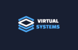
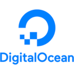

# Best VPS Providers for Privacy Curated by GitHub Users

Open Source and Always a Work in Progress (WIP)

## Abstract

This list ranks VPS and cloud compute providers by **privacy**, with a dual focus on **workload privacy** (including modern confidential computing with CPU & memory isolation/encryption, microVMs, TEEs, and attestation) and **account/identity privacy** (KYC requirements, crypto payments, and how much personal data is collected and centralized).

Only providers that have been around for **at least five years** are included, to avoid unstable, fly-by-night operations.

<!-- annotation: Technical verification over marketing claims. -->

## Methodology

### Evaluation Criteria

Our evaluation considers:

1. **Confidential Computing / Data-in-Use Protection** – AMD SEV-SNP, Intel TDX/SGX, AWS Nitro, Firecracker microVMs, attestation, etc.

2. **KYC / Identity Requirements** – Full (real name, billing, often ID), Basic (hosting account + billing), or Anonymous (email-only with crypto)

3. **Crypto Payments** – BTC, XMR, or other coins for privacy-preserving billing

4. **Privacy Positioning** – Explicit "anonymous", "offshore", "free-speech" or privacy-focused branding vs generic cloud

5. **Jurisdiction & Longevity** – Country of incorporation, data protection law, and minimum 5-year track record

<!-- callout: No provider excels at both workload and account privacy, leaving no option but to choose based on your threat model. -->

## VPS & Cloud Provider Comparison

| Rank | Provider | Confidential Computing | Anonymous Signup | Crypto | Privacy Focused | Offshore |
|------|----------|------------------------|------------------|--------|-----------------|----------|
| 1 |  [Microsoft Azure](https://azure.microsoft.com/) | [✓ Yes](https://azure.microsoft.com/en-us/solutions/confidential-compute/) | ✗ No | ✗ No | ✗ No | ✗ No |
| 2 |  [Amazon AWS EC2](https://aws.amazon.com/ec2/) | [✓ Yes](https://aws.amazon.com/ec2/nitro/) | ✗ No | ✗ No | ✗ No | ✗ No |
| 3 |  [Google Cloud Platform](https://cloud.google.com/compute) | [✓ Yes](https://cloud.google.com/confidential-computing) | ✗ No | ✗ No | ✗ No | ✗ No |
| 4 |  [Fly.io](https://fly.io/) | ✗ No (microVMs only) | ✗ No | ✗ No | ✗ No | ✗ No |
| 5 |  [BitLaunch](https://bitlaunch.io/) | ✗ No | ✓ Yes | ✓ Yes | ✓ Yes | ✓ Yes (Panama) |
| 6 |  [VSYS.host](https://vsys.host/anonymous-vps) | ✗ No | ✓ Yes | ✓ Yes | ✓ Yes | ✓ Yes |
| 7 |  [Hosteons](https://hosteons.com/) | ✗ No | ✓ Yes | ✓ Yes | ✓ Yes | ✗ No |
| 8 |  [ClientVPS](https://www.clientvps.com/anonymous-vps) | ✗ No | ✓ Yes | ✓ Yes | ✓ Yes | ✓ Yes |
| 9 |  [Shinjiru](https://www.shinjiru.com/) | ✗ No | ✗ No | ✓ Yes | ✓ Yes | ✓ Yes (Malaysia) |
| 10 |  [OrangeWebsite](https://orangewebsite.com/) | ✗ No | ✗ No | ✓ Yes | ✓ Yes | ✓ Yes (Iceland) |
| 11 |  [FlokiNET](https://flokinet.is/) | ✗ No | ✗ No | ✓ Yes | ✓ Yes | ✓ Yes (Iceland) |
| 12 |  [Linode](https://www.linode.com/) | ✗ No | ✗ No | ✗ No | ✗ No | ✗ No |
| 13 |  [DigitalOcean](https://www.digitalocean.com/) | ✗ No | ✗ No | ✗ No | ✗ No | ✗ No |
| 14 |  [Vultr](https://www.vultr.com/) | ✗ No | ✗ No | ✓ Yes | ✗ No | ✗ No |
| 15 |  [1984 Hosting](https://1984.hosting/) | ✗ No | ✗ No | ✓ Yes | ✗ No | ✓ Yes (Iceland) |

## Critical Understanding: Workload Privacy vs Account Privacy

### Class 1: Workload Privacy (Confidential Computing)

The following providers offer **cryptographic protection of data-in-use**. Your workload data is encrypted even from the cloud provider's operators.

- **Microsoft Azure**: AMD SEV-SNP, Intel TDX/SGX confidential VMs with remote attestation. Hardware-level memory encryption prevents operator access to guest RAM.
- **Amazon AWS**: Nitro System isolates guest memory from hypervisor and operators. Nitro Enclaves provide hardened execution environments.
- **Google Cloud**: Confidential VMs with AMD SEV/SEV-SNP for memory encryption. Designed for regulated industries requiring data-in-use protection.

### Class 2: Account Privacy (Anonymous/Crypto)

These providers offer **anonymous signup and crypto payments**, allowing VPS usage without identity disclosure.

- **BitLaunch**: Email-only signup with Bitcoin and 40+ altcoins. Acts as privacy front-end to major clouds (DigitalOcean, Vultr, Linode).
- **VSYS.host**: Email-only, no KYC required. Bitcoin accepted. Offshore locations (Amsterdam, Kyiv). Operating since 2009.
- **Hosteons**: No-KYC crypto hosting with Bitcoin. Budget VPS provider since 2018.
- **ClientVPS**: Email-only for crypto orders. Offshore hosting with "total privacy" positioning.

### Class 3: Offshore/Free-Speech Hosting

Long-established providers in privacy-friendly jurisdictions with strong free-speech policies.

- **Shinjiru**: Malaysia-based since 2000. Offshore hosting with crypto billing. Privacy and free-speech focused.
- **OrangeWebsite**: Iceland-based since 2009. Strong jurisdiction protections. DMCA-ignored content policy.
- **FlokiNET**: Iceland/Romania/Finland since 2012. Whistleblower and activism hosting specialist.
- **1984 Hosting**: Iceland-based since 2006. Strong GDPR/Iceland privacy law. Requires full billing but strong jurisdiction.

### Class 4: Generic Cloud (No Special Privacy Features)

Standard VPS providers with conventional security but no enhanced privacy features.

- **Linode, DigitalOcean, Vultr**: Traditional hypervisor-based VPS. Full KYC required. No confidential computing. Linode and DigitalOcean don't accept crypto natively; Vultr supports crypto via BitPay.

## Detailed Provider Analysis

### 1. Microsoft Azure

* **Infrastructure:** [AMD SEV-SNP, Intel TDX/SGX confidential VMs and enclaves](https://azure.microsoft.com/en-us/solutions/confidential-compute/)
* **Verification:** [Microsoft publishes extensive confidential computing documentation](https://learn.microsoft.com/en-us/azure/confidential-computing/) with remote attestation support
* **Org / jurisdiction:** [Microsoft Corporation](https://www.microsoft.com/), USA
* **Signup & KYC:** Full account with real-world identity required
* **Payments:** Credit card, invoicing, enterprise methods only
* **What's logged:** Standard enterprise telemetry, billing, security logs
* **Operational history:** Azure launched 2010; stable enterprise cloud

---

### 2. Amazon Web Services (AWS EC2)

* **Infrastructure:** [Nitro System hypervisor](https://aws.amazon.com/ec2/nitro/) isolates guest memory; [Nitro Enclaves](https://aws.amazon.com/ec2/nitro/nitro-enclaves/) for sensitive workloads
* **Verification:** [AWS publishes architectural guarantees](https://docs.aws.amazon.com/enclaves/latest/user/nitro-enclave.html) that operators cannot access EC2 instance memory
* **Org / jurisdiction:** [Amazon.com, Inc.](https://www.amazon.com/), USA
* **Signup & KYC:** Full AWS account and valid payment required
* **Payments:** Credit card, invoicing only
* **What's logged:** CloudTrail, billing logs, security logs
* **Operational history:** AWS EC2 launched 2006; longest-running hyperscale cloud

---

### 3. Google Cloud Platform (GCP)

* **Infrastructure:** [Confidential VMs using AMD SEV/SEV-SNP](https://cloud.google.com/confidential-computing) with memory encryption and attestation
* **Verification:** [Google provides whitepapers](https://cloud.google.com/confidential-computing/confidential-vm/docs/confidential-vm-overview) for Confidential VMs targeting regulated industries
* **Org / jurisdiction:** [Google LLC / Alphabet Inc.](https://about.google/), USA
* **Signup & KYC:** Full Google Cloud account and billing profile required
* **Payments:** Card, invoicing only
* **What's logged:** Resource usage, security monitoring logs
* **Operational history:** GCP launched ~2011; stable, widely used

---

### 4. Fly.io

* **Infrastructure:** [Firecracker microVMs](https://fly.io/docs/reference/architecture/) with encrypted volumes and WireGuard networking
* **Verification:** Uses [Firecracker](https://github.com/firecracker-microvm/firecracker) (from AWS) for microVM security; architecture docs published
* **Org / jurisdiction:** [Fly.io, Inc.](https://fly.io/), USA (founded ~2016/2017)
* **Signup & KYC:** Standard SaaS account with OAuth; billing details required
* **Payments:** Credit card only
* **What's logged:** Standard PaaS metrics, logs, billing data
* **Operational history:** Publicly launched mid-2010s; stable multi-region platform

---

### 5. BitLaunch

* **Infrastructure:** Crypto front-end for DigitalOcean, Vultr, Linode; standard hypervisors
* **Verification:** None beyond underlying providers
* **Org / jurisdiction:** BitLaunch Ltd., Panama
* **Signup & KYC:** Email-only; no real name required with crypto
* **Payments:** Bitcoin and 40+ altcoins
* **What's logged:** Minimal account metadata; IP and usage for anti-abuse
* **Operational history:** Operating since 2017

---

### 6. VSYS.host

* **Infrastructure:** KVM hypervisors in Amsterdam, Kyiv; standard VM isolation
* **Verification:** No TEEs
* **Org / jurisdiction:** Virtual Systems LLC; offshore since 2009
* **Signup & KYC:** Email-only; no personal identity required
* **Payments:** Bitcoin and other cryptocurrencies
* **What's logged:** Minimal customer info; standard server logs for abuse
* **Operational history:** Operating since 2009

---

### 7. Hosteons

* **Infrastructure:** Budget KVM VPS in multiple locations; standard hypervisors
* **Verification:** No TEEs
* **Org / jurisdiction:** Hosteons Pte Ltd; active since 2018
* **Signup & KYC:** Email only for crypto; no ID verification
* **Payments:** Crypto (BTC and others) plus traditional methods
* **What's logged:** Basic account logs for abuse management
* **Operational history:** Several years as no-KYC VPS provider

---

### 8. ClientVPS

* **Infrastructure:** Offshore VPS on standard virtualization; no TEEs
* **Verification:** None advertised
* **Org / jurisdiction:** Offshore host; active ~2016+
* **Signup & KYC:** Email-only for crypto "Anonymous VPS" orders
* **Payments:** Bitcoin and other coins
* **What's logged:** Basic logs; "total privacy solutions" positioning
* **Operational history:** ~8+ years of operation

---

### 9. Shinjiru

* **Infrastructure:** Offshore VPS and dedicated servers; standard hypervisors
* **Verification:** No TEEs
* **Org / jurisdiction:** Shinjiru Technology Sdn Bhd, Malaysia; founded 2000
* **Signup & KYC:** Basic hosting account info required
* **Payments:** Bitcoin, Ethereum, traditional methods
* **What's logged:** Billing and abuse logs; privacy-focused within legal constraints
* **Operational history:** 20+ years offshore hosting

---

### 10. OrangeWebsite

* **Infrastructure:** VPS and dedicated servers in Iceland; standard hypervisors
* **Verification:** None
* **Org / jurisdiction:** OrangeWebsite, Iceland (founded 2009)
* **Signup & KYC:** Basic hosting account data
* **Payments:** Crypto (BTC, XMR) via gateways
* **What's logged:** GDPR-compliant logs; DMCA-ignored, Icelandic law applies
* **Operational history:** ~15 years free-speech hosting

---

### 11. FlokiNET

* **Infrastructure:** VPS and dedicated servers in Iceland, Romania, Finland; standard virtualization
* **Verification:** No TEEs
* **Org / jurisdiction:** FlokiNET; operating since 2012
* **Signup & KYC:** Regular customer data required
* **Payments:** Crypto and traditional methods
* **What's logged:** Operational logs; emphasis on not disclosing to censorial regimes
* **Operational history:** 10+ years; activist and journalist focused

---

### 12. Linode (Akamai Cloud)

* **Infrastructure:** Traditional KVM-based VPS; no confidential computing
* **Verification:** Security/compliance docs; no CC products
* **Org / jurisdiction:** Founded 2003; now part of Akamai (US)
* **Signup & KYC:** Full account and billing; standard anti-fraud
* **Payments:** Card, PayPal; no crypto
* **What's logged:** Monitoring, usage, network logs
* **Operational history:** Longstanding stable provider

---

### 13. DigitalOcean

* **Infrastructure:** KVM-based droplets; simple dev cloud; no TEEs
* **Verification:** Security practices documented; no confidential computing
* **Org / jurisdiction:** DigitalOcean, LLC, USA; launched 2011
* **Signup & KYC:** Full account, payment, anti-fraud checks
* **Payments:** Credit card, PayPal; no crypto
* **What's logged:** User actions, billing/auth, network monitoring
* **Operational history:** Well-known developer cloud

---

### 14. Vultr

* **Infrastructure:** High-density KVM cloud; GPU and bare metal; no TEEs
* **Verification:** Compliance docs; no confidential computing
* **Org / jurisdiction:** Vultr Holdings, LLC; founded 2014; US-based
* **Signup & KYC:** Standard account, billing, anti-fraud
* **Payments:** Cards and traditional methods, plus cryptocurrencies via BitPay (BTC, BCH, ETH, DOGE, LTC, USDC, and similar stablecoins)
* **What's logged:** Usage and security logs
* **Operational history:** ~10 years commodity cloud

---

### 15. 1984 Hosting

* **Infrastructure:** VPS and dedicated servers in Iceland; no TEEs
* **Verification:** Security/privacy policy based on Icelandic and EU law
* **Org / jurisdiction:** 1984 Hosting Company, Iceland; founded 2006
* **Signup & KYC:** Full name and billing; Icelandic residents need national ID
* **Payments:** Standard methods plus Bitcoin (and some other cryptocurrencies) supported
* **What's logged:** GDPR-governed logs for billing and operations
* **Operational history:** ~18 years privacy-conscious hosting

## Conclusion

Azure, AWS, and GCP represent the current state-of-the-art in workload privacy through confidential computing. Their TEE-based architectures with AMD SEV-SNP, Intel TDX/SGX, and AWS Nitro provide cryptographic guarantees that even cloud operators cannot access guest memory. This is the strongest technical protection available for data-in-use.

However, these hyperscale clouds require full identity disclosure and operate under US jurisdiction, making them unsuitable for users prioritizing account anonymity or jurisdictional privacy.

For account privacy, BitLaunch, VSYS.host, Hosteons, and ClientVPS offer email-only signup with cryptocurrency payments, allowing VPS usage without identity disclosure. BitLaunch is particularly notable as it provides a privacy-preserving front-end to major cloud providers.

The offshore/free-speech category (Shinjiru, OrangeWebsite, FlokiNET, and 1984 Hosting) provides jurisdictional protection and content policy advantages. Iceland-based providers benefit from strong data protection laws and historical resistance to foreign data requests.

The ideal scenario depends on your threat model: use Azure/AWS/GCP for maximum workload confidentiality when the cloud provider itself is the threat, or use anonymous crypto-accepting providers when identity disclosure is the primary concern. For many users requiring both, the solution is layering: deploy user-level encryption (LUKS, VeraCrypt) on anonymous hosting providers to achieve both account privacy and workload protection.

<!-- navigation -->
[Abstract](#abstract) [Methodology](#methodology) [Comparison](#vps--cloud-provider-comparison) [Categories](#critical-understanding-workload-privacy-vs-account-privacy) [Details](#detailed-provider-analysis) [Conclusion](#conclusion)

## Footer

A public service by the users of GitHub.
